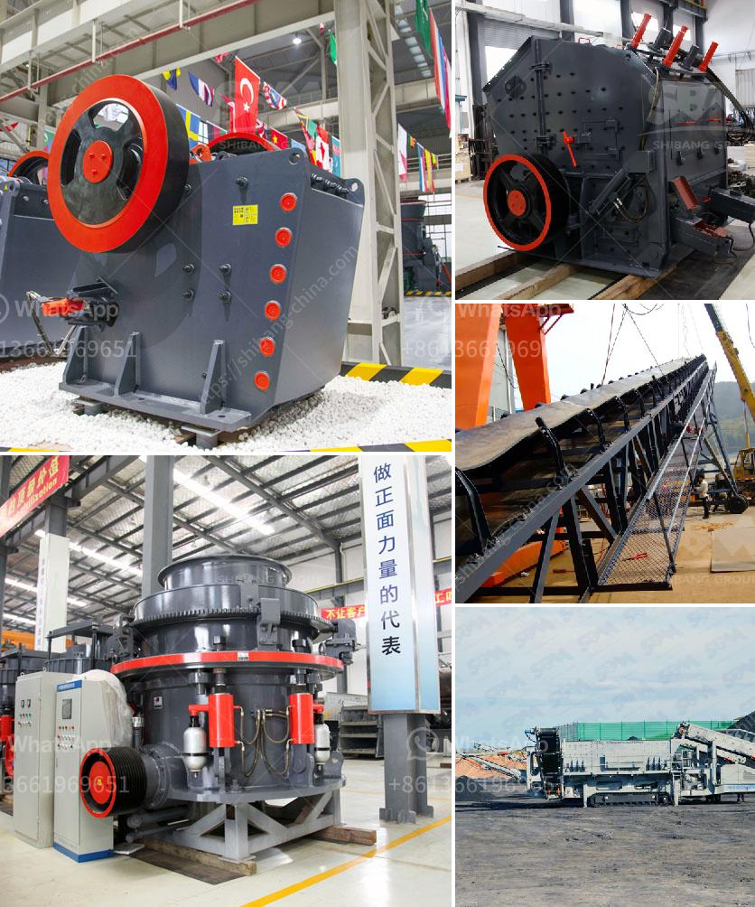

<h3>marble processing plant nigeria</h3>
Marble has been a popular decorative material since ancient times. With its elegant and unique patterns, it adds a touch of luxury to any space. Nigeria is blessed with abundant marble deposits, making it a hub for marble processing plants.

A marble processing plant in Nigeria is a place where raw marble is transformed into the beautiful marble tiles and slabs that are used in various applications such as flooring, countertops, wall cladding, and sculptures. The process involves cutting, polishing, and finishing of the marble.

One of the leading marble processing plants in Nigeria is located in the FCT, Abuja. This plant is fully equipped with modern machinery and equipment required for marble processing. The processing plant has a large capacity and can process both local and imported marble.

The marble processing plant in Nigeria utilizes the most advanced machinery and equipment, such as marble gang saws, diamond wire saws, polishing machines, bridge cutting machines, and CNC machines. These machines enable the plant to cut and process marble blocks into slabs and tiles, with precision and efficiency.

The marble processing plant in Nigeria sources its marble blocks from both local quarries and imports from other countries. The raw marble blocks are inspected for quality and then transported to the plant for processing. The blocks are cut into different sizes and thicknesses using the gang saws and diamond wire saws.

After the cutting process, the marble slabs are polished using various techniques, giving them a smooth and shiny finish. The polishing process not only enhances the aesthetic appeal of the marble but also helps protect it from stains and scratches. The finished marble slabs are then carefully inspected for any defects before they are packed and ready for distribution.

Besides marble slabs, the processing plant also produces marble tiles of different sizes and finishes. These tiles are widely used for flooring in residential and commercial buildings. They add elegance and sophistication to any space, making it more appealing.

The marble processing plant in Nigeria also offers custom cutting and fabrication services. Customers can choose from a wide range of marble slabs and tiles and have them cut and shaped according to their specific requirements. The plant has a team of skilled craftsmen who can create unique designs and patterns on the marble, catering to the individual preferences of customers.

The marble processing plant in Nigeria plays a significant role in the marble industry, not only in Nigeria but also in the global market. With its advanced machinery and equipment, it produces high-quality marble products that are in demand both locally and internationally.

In conclusion, the marble processing plant in Nigeria is a vital establishment that contributes to the growth and development of the marble industry. It utilizes modern machinery and equipment to transform raw marble into beautiful slabs and tiles. The plant offers a wide range of marble products, catering to the needs of customers both in Nigeria and beyond. With its commitment to quality and customer satisfaction, the marble processing plant in Nigeria is set to thrive in the coming years.
<h3>Contact us</h3><ul><li><strong>Whatsapp:&nbsp;<a href="https://wa.me/8613661969651">+8613661969651</a></strong></li><li><a href="https://swt.shibang-china.com/?git&amp;zhl&amp;marble processing plant nigeria"><strong>Online Service(chat now)</strong></a></li></ul><h3>Related</h3><ul><li><a href='harga mesin molen di medan.md'>harga mesin molen di medan</a></li><li><a href='suppliers of coveyor belting in durban.md'>suppliers of coveyor belting in durban</a></li><li><a href='hammer mill mining.md'>hammer mill mining</a></li><li><a href='granite crusher machines.md'>granite crusher machines</a></li><li><a href='cement clinker ball mill.md'>cement clinker ball mill</a></li></ul>