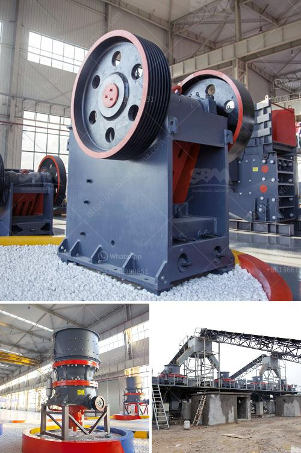

<h3>marble stone grinder mill</h3>
In every kitchen, there are certain tools that are considered indispensable. One such tool is the marble stone grinder mill, which is widely used for grinding spices, herbs, coffee beans, and even grains. With its sturdy build and ability to produce fine and consistent grinds, this mill has become a must-have for modern kitchens.

When it comes to grinding, consistency is key, and that’s where the marble stone grinder mill excels. Made from a single solid piece of high-quality marble, this mill offers exceptional durability and even grinding results. The heaviness of the marble not only makes the mill more stable but also helps to keep your spices, herbs, and coffee beans at an optimal temperature, preserving their true flavors.

The design of the grinder mill is also worth mentioning. Smooth and polished, it adds an element of elegance to any kitchen countertop. The handle is ergonomically designed, making it easy and comfortable to grind even large quantities. The grinding mechanism is also adjustable, allowing you to choose between a coarse or fine grind, depending on your recipe or personal preference. The simplicity and efficiency of this tool make it suitable for both professional chefs and home cooks.

One of the key advantages of using a marble stone grinder mill is the ability to release the maximum flavor from your ingredients. Whether you’re grinding spices for a curry powder or fresh coffee beans for a delicious cup of coffee, this mill ensures that each grind is consistent and produces an aroma-filled result. The natural cooling properties of the marble also prevent the loss of volatile oils, which are responsible for the intense flavors and aromas in spices and coffee.

Furthermore, the marble stone grinder mill offers easy cleaning and maintenance. The smooth surface of the marble makes it a breeze to wipe off any residue or oils left behind after grinding. Unlike other materials, such as wood or plastic, marble is non-porous, preventing the buildup of bacteria or odors. In addition, the sturdy construction means that this mill will last for years without any signs of wear or corrosion.

Overall, the marble stone grinder mill is a kitchen tool that combines functionality and aesthetics. Its ability to deliver consistent grinds, preserve flavors, and add an elegant touch to your kitchen makes it a must-have for every cooking enthusiast. Whether you’re grinding spices, herbs, or coffee beans, this mill will elevate your cooking experience by unlocking the true flavors of your ingredients. So, why settle for pre-ground spices and coffee when you can easily achieve superior results with the marble stone grinder mill? Give your recipes that extra level of perfection with this versatile and reliable tool.
<h3>Contact us</h3><ul><li><strong>Whatsapp:&nbsp;<a href="https://wa.me/8613661969651">+8613661969651</a></strong></li><li><a href="https://swt.shibang-china.com/?git&amp;zhl&amp;marble stone grinder mill"><strong>Online Service(chat now)</strong></a></li></ul><h3>Related</h3><ul><li><a href='crusher dimensions crusher conica.md'>crusher dimensions crusher conica</a></li><li><a href='cost estimate ball mill.md'>cost estimate ball mill</a></li><li><a href='ball mill operation and maintenance manual pdf.md'>ball mill operation and maintenance manual pdf</a></li><li><a href='hammer mill for sale philippines.md'>hammer mill for sale philippines</a></li><li><a href='gold mining equipment for sale at malaysia.md'>gold mining equipment for sale at malaysia</a></li></ul>