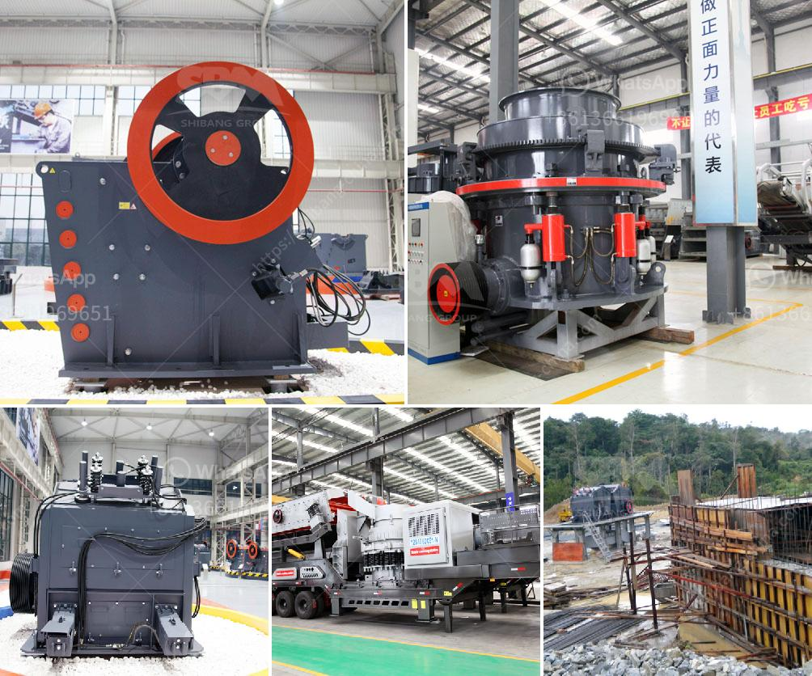

<h3>material composition for coal screen</h3>
A coal screen is an essential piece of equipment used in the mining and processing of coal. Its primary purpose is to separate coal particles of varying sizes into different grades, ensuring quality control in coal production. To achieve optimal performance and longevity, the material composition of a coal screen plays a significant role.

The ideal material composition for a coal screen should exhibit several key properties. Firstly, it should possess high strength and toughness to withstand the harsh and abrasive conditions encountered during coal processing. The coal screen is subjected to continuous impacts and vibrations while ensuring effective separation, making durability a crucial factor in its design.

Furthermore, resistance to corrosion and wear is essential. Coal screens constantly come into contact with moisture and corrosive elements present in the coal, which can lead to rusting and deterioration if not adequately protected. Therefore, materials with anti-corrosion properties such as stainless steel or corrosion-resistant alloys are commonly employed in coal screens.

In addition to durability and corrosion resistance, the material composition should also consider the desired screening efficiency. The choice of material can impact the screen's ability to effectively separate coal particles based on size. Some materials may cause excessive blinding or clogging, reducing the screen's efficiency. Therefore, the composition must strike a balance between durability and the ability to allow efficient particle separation.

Traditionally, coal screens were primarily made of carbon steel due to its reasonable cost and adequate strength. However, advancements in materials technology have led to the development of more specialized alloys and coatings. For instance, high carbon stainless steel provides excellent wear resistance, while polyurethane coatings enhance corrosion resistance and minimize screen blinding.

Ultimately, the selection of the material composition for a coal screen should be based on a comprehensive evaluation of the specific requirements of the coal processing operation. Factors such as feed material characteristics, anticipated throughput, and expected maintenance schedules must all be taken into account.

In conclusion, the material composition of a coal screen is a critical factor in ensuring its efficiency and durability. By employing materials possessing high strength, corrosion resistance, and optimized particle separation properties, mining companies can enhance the overall reliability and productivity of their coal processing operations. As technology continues to advance, further improvements in material composition will likely shape the future of coal screening, driving enhanced performance and efficiency in this crucial segment of the coal mining industry.
<h3>Contact us</h3><ul><li><strong>Whatsapp:&nbsp;<a href="https://wa.me/8613661969651">+8613661969651</a></strong></li><li><a href="https://swt.shibang-china.com/?git&amp;zhl&amp;material composition for coal screen"><strong>Online Service(chat now)</strong></a></li></ul><h3>Related</h3><ul><li><a href='calcium carbonate plant layout diagram.md'>calcium carbonate plant layout diagram</a></li><li><a href='crushing asphalt with jaw crusher.md'>crushing asphalt with jaw crusher</a></li><li><a href='how to start sand business in nigeria.md'>how to start sand business in nigeria</a></li><li><a href='sample of gold mining business plan in ghana.md'>sample of gold mining business plan in ghana</a></li><li><a href='ball mill 5 tonnes.md'>ball mill 5 tonnes</a></li></ul>