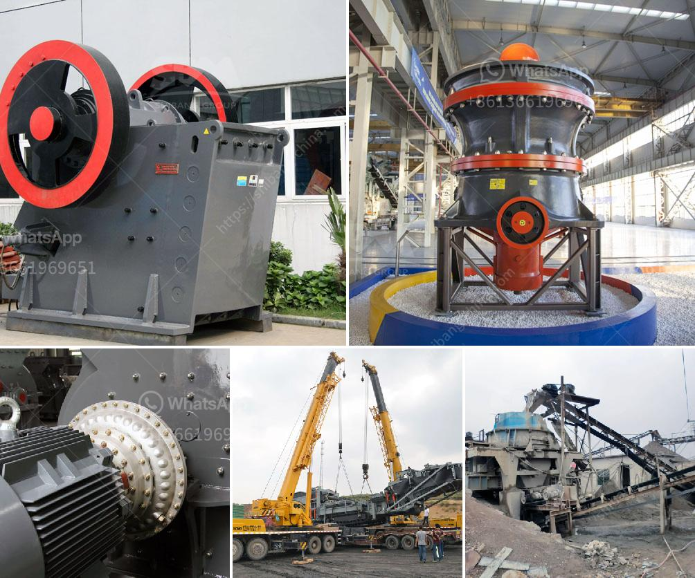

<h3>materials for conveyor belts in nigeria</h3>
Conveyor belts play a crucial role in various industries, facilitating the transportation of goods and materials from one place to another. In Nigeria, where industries are rapidly growing, the demand for conveyor belts is also increasing. However, it is essential to understand the different materials used for conveyor belts and their suitability for Nigerian industries.

One commonly used material for conveyor belts is rubber. Rubber conveyor belts are known for their durability, flexibility, and resistance to impact and abrasion. They can withstand high temperatures and offer excellent grip, making them suitable for mining, construction, and agriculture industries in Nigeria.

Another material used for conveyor belts is PVC (Polyvinyl Chloride). PVC belts are lightweight, cost-effective, and easy to clean. They are resistant to oil, chemicals, and moisture, making them well-suited for food processing, pharmaceutical, and packaging industries in Nigeria.

Furthermore, nylon is an incredibly strong material that is frequently used in conveyor belts. It offers high impact resistance and maximum load capacity, making it ideal for heavy-duty industries like mining and construction. Nylon conveyor belts are also resistant to heat, oil, and chemicals, further enhancing their suitability for Nigerian industries.

Additionally, steel is another material used for conveyor belts, mainly in heavy-duty applications. Steel belts provide excellent stability and strength, allowing them to carry heavy loads without compromising functionality. However, due to their high cost, steel conveyor belts are less common in Nigeria.

In conclusion, conveyor belts are essential for the smooth operation of various industries in Nigeria. Rubber, PVC, nylon, and steel are commonly used materials for conveyor belts, each offering unique characteristics suitable for different industries. Understanding these materials' properties can help Nigerian industries make informed decisions when selecting conveyor belts that best meet their specific requirements.
<h3>Contact us</h3><ul><li><strong>Whatsapp:&nbsp;<a href="https://wa.me/8613661969651">+8613661969651</a></strong></li><li><a href="https://swt.shibang-china.com/?git&amp;zhl&amp;materials for conveyor belts in nigeria"><strong>Online Service(chat now)</strong></a></li></ul><h3>Related</h3><ul><li><a href='marble crusher machinery manufacturer.md'>marble crusher machinery manufacturer</a></li><li><a href='carbon black grinding machine.md'>carbon black grinding machine</a></li><li><a href='impact crusher 5tph for sale south africa.md'>impact crusher 5tph for sale south africa</a></li><li><a href='manganese metal production process.md'>manganese metal production process</a></li><li><a href='ball mills as size reduction equipment.md'>ball mills as size reduction equipment</a></li></ul>