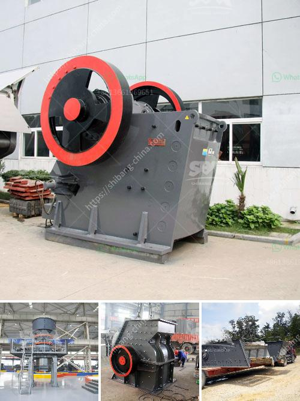

<h3>materials hammer mill</h3>
A hammer mill is a machine used to shred or crush materials into smaller pieces. It is an essential tool for many industries, including recycling, mining, and farming. The hammer mill uses a series of hammers to effectively break down materials, potentially saving additional downstream processing equipment and reducing overall operational costs.

Materials that can be processed by a hammer mill vary widely, from biomass such as wood chips and straw, to industrial materials like gypsum and limestone. The versatility of the hammer mill makes it an ideal processing equipment for the diversity of raw materials encountered in these industries.

One of the key advantages of a hammer mill is its ability to produce a wide range of particle sizes. This is achieved by controlling the size of the openings in the mill’s screens. Smaller screen sizes result in finer particles, while larger openings produce coarser materials. By adjusting the screen size, the operator can tailor the final product to meet specific requirements.

The working principle of a hammer mill involves a high-speed rotor that revolves around a central axis. As the rotor spins, the hammers attached to it strike the incoming material, shredding it into smaller fragments. The particles are then forced through the mill’s screens, where the desired size is achieved.

Some hammer mills include additional features to enhance their performance. For example, a gravity discharge system uses gravity to evacuate the processed material from the mill, reducing energy consumption and wear on the hammers. In contrast, an air-assist system uses airflow to transport the ground material, ensuring a consistent product flow and preventing clogs.

In terms of maintenance and durability, hammer mills have a reputation for being robust machines that require minimal upkeep. Routine maintenance typically involves inspection and cleaning of the screens and hammers. The manufacturer’s guidelines should be followed to ensure the longevity and optimal performance of the machine.

When selecting a hammer mill, it is important to consider factors such as the desired output capacity, the size and nature of the raw material, and the operational requirements of the facility. Hammer mills are available in various sizes and configurations to accommodate different applications. It may be advantageous to consult with a knowledgeable supplier to determine the most suitable model for the specific needs.

In conclusion, a hammer mill is a versatile and efficient machine for processing a wide range of materials. Its ability to produce different particle sizes and low maintenance requirements make it a valuable asset in various industries. Whether it is used in recycling, mining, or farming, a hammer mill offers a cost-effective and efficient solution for material processing.
<h3>Contact us</h3><ul><li><strong>Whatsapp:&nbsp;<a href="https://wa.me/8613661969651">+8613661969651</a></strong></li><li><a href="https://swt.shibang-china.com/?git&amp;zhl&amp;materials hammer mill"><strong>Online Service(chat now)</strong></a></li></ul><h3>Related</h3><ul><li><a href='small scale cement plants in india.md'>small scale cement plants in india</a></li><li><a href='estimasi biaya usaha stone crusher.md'>estimasi biaya usaha stone crusher</a></li><li><a href='cornerstone equipment used rock crushers.md'>cornerstone equipment used rock crushers</a></li><li><a href='portable crushing mill.md'>portable crushing mill</a></li><li><a href='marble mining equipment.md'>marble mining equipment</a></li></ul>