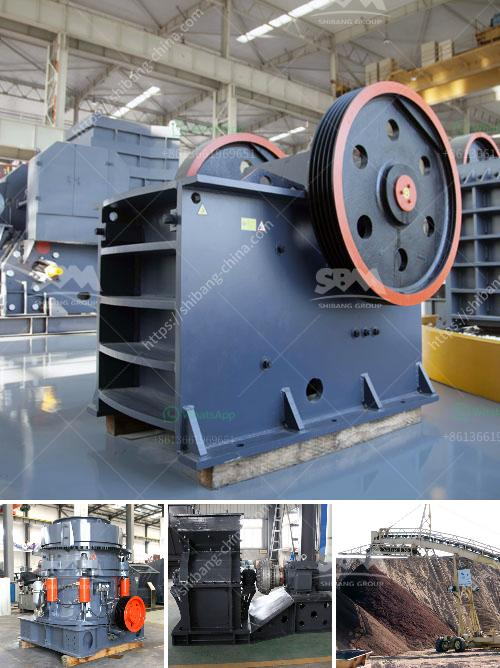

<h3>materials used to make a talcum powder</h3>
Talcum powder, also known as baby powder, has been a staple in households for decades. It is commonly used for delicate skincare purposes, such as soothing irritated skin and keeping it soft and dry. But have you ever wondered about the materials that go into making talcum powder? Let's take a closer look at the main components used in the production of this essential household product.

The primary ingredient in talcum powder is talc, a naturally occurring mineral. Talc is mined from the earth and is composed of magnesium, silicon, and oxygen. It is known for its softness and ability to absorb moisture, making it ideal for skincare products like powder. Because of its gentle nature, talc is suitable for all skin types, including sensitive skin.

Talcum powder also contains other ingredients to enhance its effectiveness and provide additional benefits. One commonly added ingredient is cornstarch. Cornstarch acts as a thickening agent and absorbs excess moisture, making the powder even more effective in preventing skin irritation and keeping areas like the diaper area dry. Cornstarch is derived from corn kernels and is widely used in the food industry as well.

To further enhance the powder's texture and scent, fragrance and essential oils are often included. Fragrances can vary widely, ranging from floral scents to more delicate and even unscented options. Essential oils such as lavender or chamomile may also be added for their soothing and calming properties, providing an extra level of comfort when using talcum powder.

Finally, certain manufacturers may add additional ingredients to tailor the talcum powder for specific needs. Some powders are enriched with vitamins and minerals to provide nourishment to the skin. Others may contain additives like aloe vera or shea butter, known for their moisturizing and healing properties. These added ingredients are intended to improve the overall skincare benefits of talcum powder.

It is essential to note that in recent years, concerns have been raised regarding the potential risks associated with talcum powder. There have been claims linking its use to ovarian cancer and respiratory problems when inhaled. As a result, some manufacturers have started producing talcum powder that is talc-free, using alternative ingredients such as arrowroot powder or rice starch. These talc-free alternatives aim to offer similar benefits while addressing the safety concerns.

In conclusion, talcum powder is primarily made from talc, a naturally occurring mineral known for its softness and moisture-absorbing properties. Additional ingredients like cornstarch, fragrance, and essential oils are added to enhance effectiveness and provide pleasant scents. Some powders may also include extra ingredients like vitamins, minerals, or plant extracts for added skincare benefits. While concerns have arisen surrounding talc, leading to the development of talc-free alternatives, talcum powder remains widely used and appreciated for its skincare qualities.
<h3>Contact us</h3><ul><li><strong>Whatsapp:&nbsp;<a href="https://wa.me/8613661969651">+8613661969651</a></strong></li><li><a href="https://swt.shibang-china.com/?git&amp;zhl&amp;materials used to make a talcum powder"><strong>Online Service(chat now)</strong></a></li></ul><h3>Related</h3><ul><li><a href='thailand granite quarry crusher.md'>thailand granite quarry crusher</a></li><li><a href='china henan machinery small ball mill.md'>china henan machinery small ball mill</a></li><li><a href='iron ore crushing plant in germany.md'>iron ore crushing plant in germany</a></li><li><a href='impact jaw crusher.md'>impact jaw crusher</a></li><li><a href='china ball mill manufacturer.md'>china ball mill manufacturer</a></li></ul>