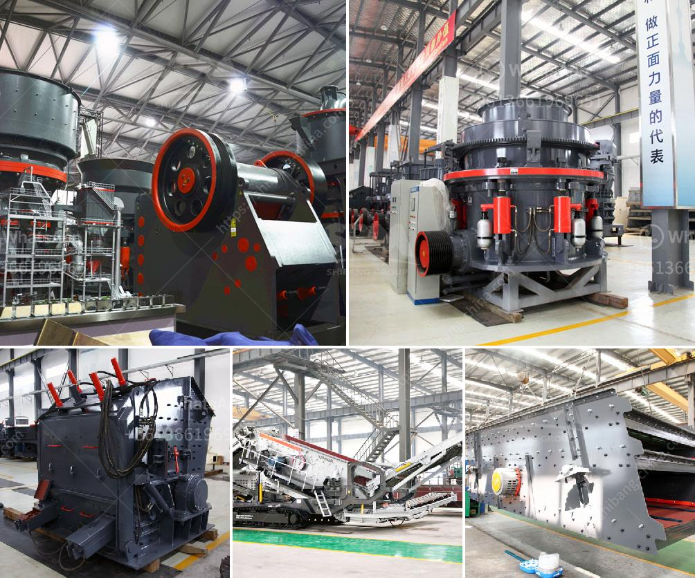

<h3>metal crusher for sale in turkey</h3>
In recent years, the global emphasis on sustainable practices and the need to reduce environmental impact has led to a significant rise in recycling initiatives worldwide. Turkey, a country known for its rich industrial production, has recognized the importance of recycling and has started to invest in recycling facilities and equipment. One such equipment that has gained popularity in the country is the metal crusher, which aids in the recycling of metal scraps.

Metal crushers are machines designed to break down metal waste into smaller, more manageable pieces. They are commonly used in scrapyards and metal recycling facilities to reduce the volume of metal waste, making it easier to transport and process. This process not only saves space but also helps in reducing the energy and resources required for processing new metals.

Turkey, with its flourishing industrial sector, generates a significant amount of metal waste that needs appropriate disposal. The metal crusher for sale in Turkey presents an efficient solution to this problem. These crushers are manufactured with strong and durable materials, ensuring high performance and long-lasting service. They are equipped with an array of features such as hydraulic systems, automatic feeding mechanisms, and adjustable cutting speeds, enhancing their functionality and versatility.

The benefits of metal crushers in Turkey extend beyond just waste management. By investing in these machines, businesses can also generate revenue by selling the crushed metal waste to recycling companies. This creates a circular economy where metal waste is recycled and reused, reducing the need for mining and extraction of new resources.

Moreover, metal crushers have a positive impact on the environment by reducing the carbon footprint associated with metal production. Recycling scrap metal significantly reduces greenhouse gas emissions, energy consumption, and water pollution, making it an eco-friendly alternative to traditional methods of metal production.

As the demand for metal crushers in Turkey continues to grow, there are several suppliers and manufacturers offering a variety of models suitable for different industries. Potential buyers can choose from a range of sizes and capacities to match their specific requirements.

In conclusion, the metal crusher for sale in Turkey provides an effective means of recycling metal waste, benefiting both the environment and businesses. By investing in this equipment, companies can meet their sustainability goals, reduce their environmental impact, and contribute to the development of a circular economy. With the ongoing focus on recycling and sustainable practices, the metal crusher industry is expected to thrive in Turkey in the coming years.
<h3>Contact us</h3><ul><li><strong>Whatsapp:&nbsp;<a href="https://wa.me/8613661969651">+8613661969651</a></strong></li><li><a href="https://swt.shibang-china.com/?git&amp;zhl&amp;metal crusher for sale in turkey"><strong>Online Service(chat now)</strong></a></li></ul><h3>Related</h3><ul><li><a href='used ball mill for calcium carbonate sell india.md'>used ball mill for calcium carbonate sell india</a></li><li><a href='3 roller mill manufacturers in india.md'>3 roller mill manufacturers in india</a></li><li><a href='feldspar mining process.md'>feldspar mining process</a></li><li><a href='marble processing plant nigeria.md'>marble processing plant nigeria</a></li><li><a href='crusher machines for granite in nigeria.md'>crusher machines for granite in nigeria</a></li></ul>