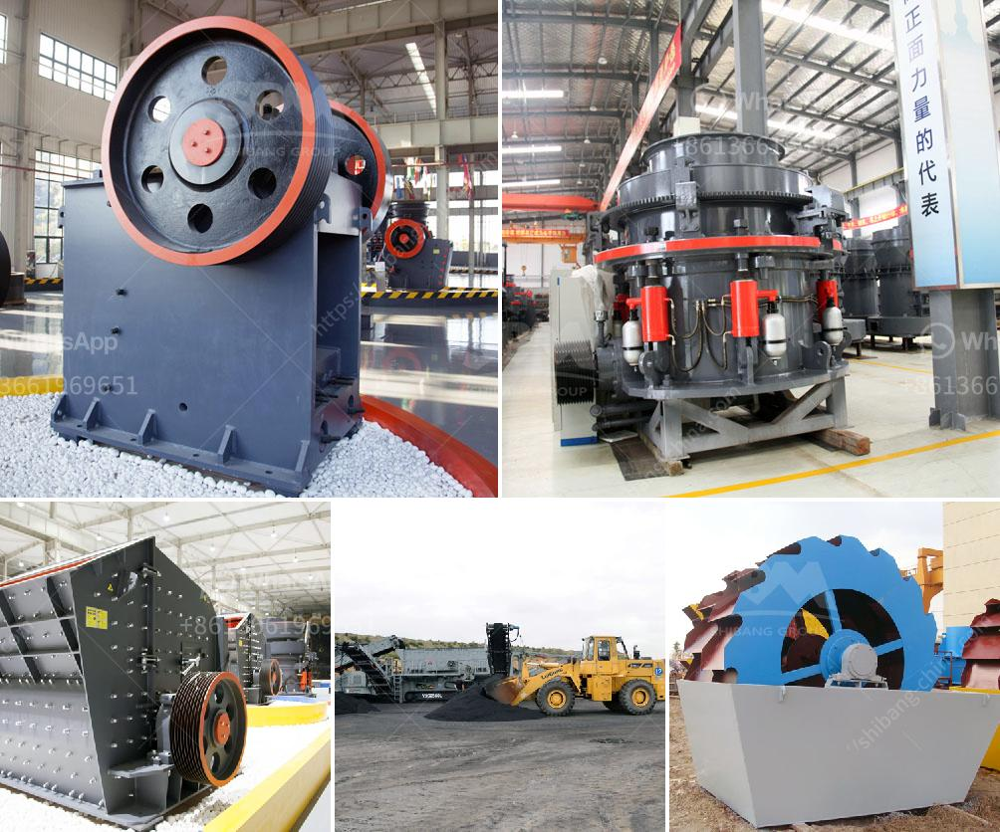

<h3>method statement for a barite mill</h3>
Barite, or barium sulfate, is a mineral that is primarily used as a weighting agent in drilling fluids for oil and gas exploration. It is crucial to ensure the safe and efficient operation of a barite mill, as incorrect handling and processing of barite can lead to serious health and safety hazards. A method statement serves as a step-by-step guide for workers to follow, ensuring that the necessary precautions are taken to minimize risks. In this article, we will outline the key components of a method statement for a barite mill.

Begin the method statement with a brief introduction to the project. Highlight the location and purpose of the barite mill, as well as the expected duration of the operation. This helps to provide context for the workers and allows them to understand the importance of following the method statement.

Emphasize the importance of health and safety throughout the process. Clearly outline the potential hazards associated with barite handling, such as inhalation of dust particles, slips and trips, and fire/explosion risks. Provide information on the appropriate personal protective equipment (PPE) that workers should wear, including respiratory masks, gloves, and safety goggles.

Detail the proper procedures for handling and storing barite. This should include guidelines on how to load and unload barite bags from trucks, emphasizing the need for correct lifting techniques and manual handling practices. Provide instructions on how to stack and store barite bags in a secure manner to prevent toppling and ensure the safety of workers.

Describe the steps involved in the milling process, highlighting the equipment that will be used, such as crushers, conveyors, and mills. Explain how the raw barite will be fed into the mill and the required parameters for efficient operation. Emphasize the importance of regular equipment inspections and maintenance to prevent breakdowns and ensure the longevity of machinery.

Address the proper management of waste generated during the milling process. Explain the need for separating and disposing of waste materials in accordance with environmental regulations. Provide guidelines for the safe handling and disposal of hazardous waste, such as used oil or chemicals, to prevent environmental contamination and protect workers' health.

Outline the emergency response procedures that should be followed in the event of a fire, explosion, or other emergency situations. This should include the location and proper use of firefighting equipment, emergency shutdown procedures, and the evacuation plan. Encourage workers to undergo regular emergency training to enhance their preparedness and response capabilities.

Stress the importance of maintaining accurate and up-to-date documentation throughout the barite milling operation. This includes recording the quantity of barite received, processed, and stored, as well as any incidents, inspections, or maintenance activities. Encourage workers to report any concerns or near-miss incidents to ensure continuous safety improvement.

In conclusion, a method statement for a barite mill is a comprehensive document that provides workers with clear instructions on how to safely and efficiently handle, process, and store barite. By following these guidelines, workers can minimize risks, prevent accidents, and ensure the smooth operation of the mill. Prioritizing health and safety throughout the process is essential to protect both workers and the environment.
<h3>Contact us</h3><ul><li><strong>Whatsapp:&nbsp;<a href="https://wa.me/8613661969651">+8613661969651</a></strong></li><li><a href="https://swt.shibang-china.com/?git&amp;zhl&amp;method statement for a barite mill"><strong>Online Service(chat now)</strong></a></li></ul><h3>Related</h3><ul><li><a href='how to calculate tph of a cone crusher.md'>how to calculate tph of a cone crusher</a></li><li><a href='mobile stone crusher price ph.md'>mobile stone crusher price ph</a></li><li><a href='gold processing machinery in china.md'>gold processing machinery in china</a></li><li><a href='mobile crushers and screens.md'>mobile crushers and screens</a></li><li><a href='mining mobile crusher and washing lebanon.md'>mining mobile crusher and washing lebanon</a></li></ul>