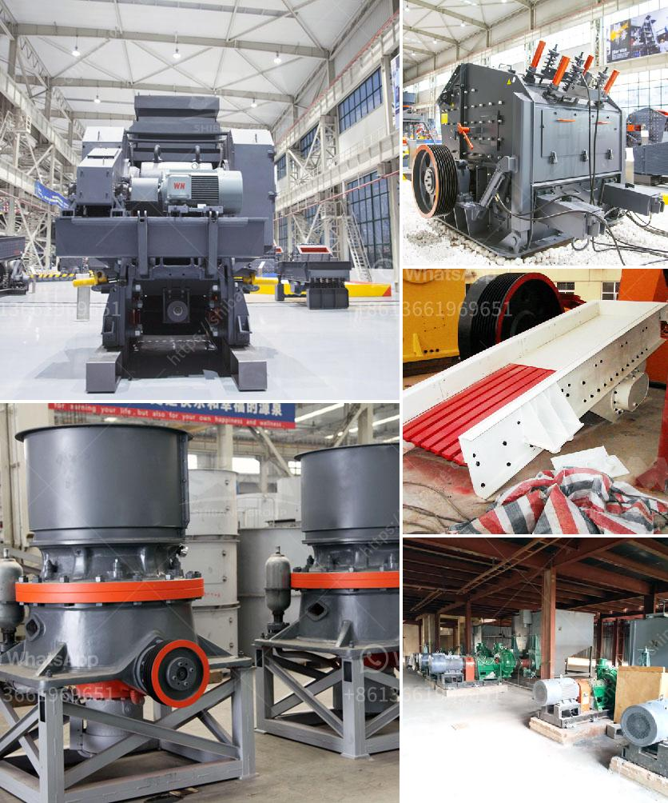

<h3>mica powder machine in pakistan</h3>
Mica powder is widely used in various industries due to its unique properties and versatility. In Pakistan, the demand for mica powder has been steadily increasing, leading to the establishment of mica powder machines in the country. These machines play a pivotal role in the extraction, processing, and distribution of mica powder, ensuring a steady supply to meet the market demands.

One of the primary uses of mica powder in Pakistan is in the cosmetics and personal care industry. Mica powder is used as an ingredient in various cosmetic products, including eyeshadows, blushes, lipsticks, and nail polishes. It provides a shimmering effect and enhances the overall appearance of the product. The mica powder machines in Pakistan are responsible for grinding, classifying, and processing mica powder, ensuring its high purity and suitability for use in cosmetics.

Moreover, mica powder is also used in the paint and coatings industry in Pakistan. It is added to paints to increase their durability, resistance to moisture, and improve their adhesion to different surfaces. Mica powder machines in Pakistan enable manufacturers to produce high-quality mica powder that meets the specific requirements of the paint industry. These machines ensure that the mica powder is finely ground and free from impurities, allowing for a smooth and consistent application of the paint.

In addition to cosmetics and paints, mica powder is also used in the plastic industry. It is added to plastics to improve their strength, flexibility, and thermal resistance. Mica powder machines in Pakistan are equipped with advanced technology to produce mica powder with the desired particle size and consistency. This ensures that the mica powder effectively reinforces the plastic, enhancing its overall performance.

Furthermore, mica powder has applications in the construction industry. It is used as an additive in cement and mortar to improve their workability, reduce cracking, and increase their resistance to water and chemicals. Mica powder machines in Pakistan are capable of producing mica powder with different mesh sizes, allowing manufacturers to choose the most suitable particle size for their construction materials.

The establishment of mica powder machines in Pakistan has brought numerous benefits to the country's economy. These machines provide employment opportunities for local workers, helping to alleviate unemployment and improve the standard of living. Additionally, the production and distribution of mica powder contribute to the growth of the industrial sector in Pakistan, increasing its export potential and generating revenue for the country.

In conclusion, mica powder machines in Pakistan play a vital role in meeting the growing demand for mica powder in various industries. These machines ensure the extraction, processing, and distribution of high-quality mica powder, enabling its use in cosmetics, paints, plastics, and construction materials. The establishment of these machines has not only boosted the economy but also provided employment opportunities, contributing to the overall development of Pakistan.
<h3>Contact us</h3><ul><li><strong>Whatsapp:&nbsp;<a href="https://wa.me/8613661969651">+8613661969651</a></strong></li><li><a href="https://swt.shibang-china.com/?git&amp;zhl&amp;mica powder machine in pakistan"><strong>Online Service(chat now)</strong></a></li></ul><h3>Related</h3><ul><li><a href='best coal crusher machine pdf.md'>best coal crusher machine pdf</a></li><li><a href='price of ball mill.md'>price of ball mill</a></li><li><a href='raymond grinding mill germany.md'>raymond grinding mill germany</a></li><li><a href='quarry impact crusher equipment.md'>quarry impact crusher equipment</a></li><li><a href='crusher sand machine south africa.md'>crusher sand machine south africa</a></li></ul>