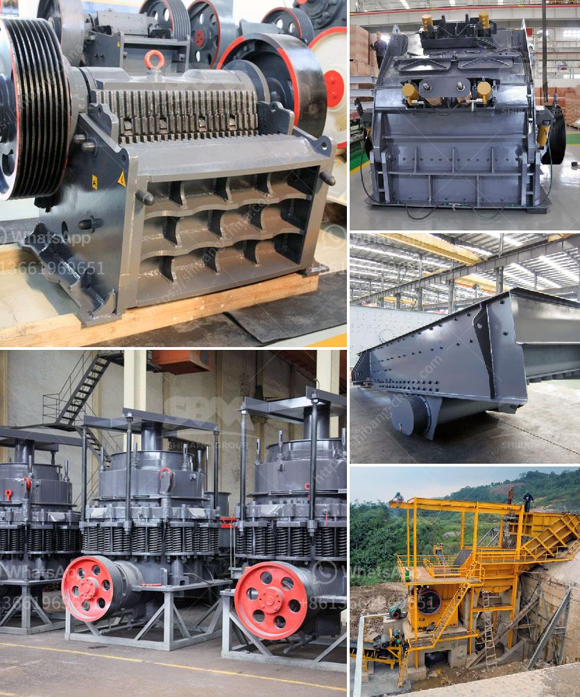

<h3>mica powder manufacturers machinery</h3>
Mica powder is a versatile material that is extensively used in industries such as cosmetics, automotive, electronics, and construction. It is a natural mineral that is ground into a fine powder to create a shimmering effect. Mica powder manufacturers play a crucial role in producing high-quality mica powder for various applications. In this article, we will explore the machinery used by these manufacturers to produce mica powder.

The process of manufacturing mica powder begins with the procurement of raw mica. Mica is extracted from mines and quarries all around the world. It is a delicate mineral that requires careful handling during extraction to ensure its quality. Once the raw mica is obtained, it undergoes a series of processes to be transformed into a fine powder.

The first step in the manufacturing process is cleaning the raw mica. The mica is carefully cleaned to remove any impurities, such as dirt and other minerals. This is often done using water and gentle agitation to ensure the mica is not damaged or broken during the cleaning process.

After cleaning, the mica is then dried. Drying is essential as it removes any excess moisture from the mica, making it easier to grind into a powder. Various drying techniques are used, including the use of dryers and ovens, to ensure the mica is thoroughly dried without causing any damage.

Once dried, the mica goes through a grinding process to convert it into a powder form. Grinding machines are utilized to crush and refine the mica particles into a consistent size. There are various types of grinding machines used, including ball mills, hammer mills, and jet mills. These machines use different mechanisms to pulverize the mica, ensuring a fine and uniform powder is obtained.

The ground mica powder is then classified through a process called sieving. Sieving helps separate the mica particles based on their size. This is crucial as different industries require mica powder of specific particle sizes to suit their applications. Sieving machines, often equipped with multiple mesh screens, are used to achieve the desired particle size distribution.

Once classified, the mica powder is ready for packaging. Specialized machinery is employed to fill the powder into containers or bags, ensuring accurate measurements and preventing any contamination. The packaging process is often automated to enhance productivity and maintain the quality of the mica powder.

In addition to the machinery mentioned above, mica powder manufacturers also rely on equipment for quality control. This includes instruments such as particle size analyzers and color measurement devices to ensure the mica powder meets the required specifications.

Overall, the machinery used by mica powder manufacturers is designed to efficiently and effectively transform raw mica into a high-quality powder. Each step of the manufacturing process, from cleaning to packaging, requires specialized equipment to ensure the integrity and consistency of the final product. The use of advanced machinery enables manufacturers to meet the demand for mica powder in various industries and contribute to the growth of these sectors.
<h3>Contact us</h3><ul><li><strong>Whatsapp:&nbsp;<a href="https://wa.me/8613661969651">+8613661969651</a></strong></li><li><a href="https://swt.shibang-china.com/?git&amp;zhl&amp;mica powder manufacturers machinery"><strong>Online Service(chat now)</strong></a></li></ul><h3>Related</h3><ul><li><a href='crusher suppliers in kenya.md'>crusher suppliers in kenya</a></li><li><a href='hammer mill for sale philippines.md'>hammer mill for sale philippines</a></li><li><a href='jaw crusher for 100x200.md'>jaw crusher for 100x200</a></li><li><a href='price of stone crush machine in pakistan.md'>price of stone crush machine in pakistan</a></li><li><a href='impact crusher for sale johannesburg.md'>impact crusher for sale johannesburg</a></li></ul>