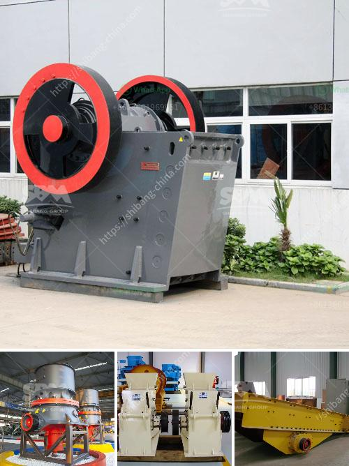

<h3>micro fine powder grinder</h3>
Micro fine powder grinder is a high-efficiency and low-consumption ultrafine powder processing equipment designed and developed by our company technicians and engineers in combination with national and international advanced production technology. It has many advantages such as small size, large output, stable operation, and high efficiency. It is the ideal equipment for the ultrafine powder processing industry.

The micro fine powder grinder is widely used in industries such as metallurgy, mining, chemical, cement, construction, refractory materials, ceramics, and so on. The grinding materials include calcite, limestone, dolomite, talc, barite, gypsum, kaolin, bentonite, marble, graphite, and other Mohs hardness below 7 and humidity within 6%. The fineness of the finished product can be adjusted arbitrarily between 325-3000 mesh, and the output can reach 0.5-12 tons per hour. The equipment has a small footprint and is simple and convenient to operate. It can be used for grinding various materials with high efficiency and environmental protection.

The micro fine powder grinder adopts an advanced dust removal system, which can effectively separate dust and powder. It ensures that the working environment is clean and tidy, effectively improving the working efficiency and reducing the production cost. The dust removal device adopts a pulse dust collector, which has a small floor space, low energy consumption, and a high collection efficiency. It effectively solves the problem of excessive dust flying during the grinding process and improves the cleanliness of the working environment.

The micro fine powder grinder has the advantages of high-speed impact grinding, low energy consumption, and less wear. The grinding roller and grinding ring are made of special wear-resistant steel, which has a longer service life. The electrical system adopts centralized control, which is easy to operate and maintain. The important parts are made of high-quality wear-resistant materials, and the wear-resistant performance is significantly improved. The equipment has stable performance and reliable operation, which can ensure the efficient and stable operation of the ultrafine powder processing.

In summary, the micro fine powder grinder is a highly efficient and low-consumption ultrafine powder processing equipment. It has many advantages such as small size, large output, stable operation, and high efficiency, which can meet the needs of customers in various industries. With the continuous improvement of the manufacturing process and technology, the micro fine powder grinder will continue to be optimized and improved, providing high-quality powder products for various industries and promoting the development of the ultrafine powder processing industry.
<h3>Contact us</h3><ul><li><strong>Whatsapp:&nbsp;<a href="https://wa.me/8613661969651">+8613661969651</a></strong></li><li><a href="https://swt.shibang-china.com/?git&amp;zhl&amp;micro fine powder grinder"><strong>Online Service(chat now)</strong></a></li></ul><h3>Related</h3><ul><li><a href='crushing asphalt with jaw crusher.md'>crushing asphalt with jaw crusher</a></li><li><a href='used gold mill for sale south africa.md'>used gold mill for sale south africa</a></li><li><a href='feasibility report on block making industry in nigeria.md'>feasibility report on block making industry in nigeria</a></li><li><a href='conveyor belt for fly ash.md'>conveyor belt for fly ash</a></li><li><a href='stone crusher plant for sale in saudi.md'>stone crusher plant for sale in saudi</a></li></ul>