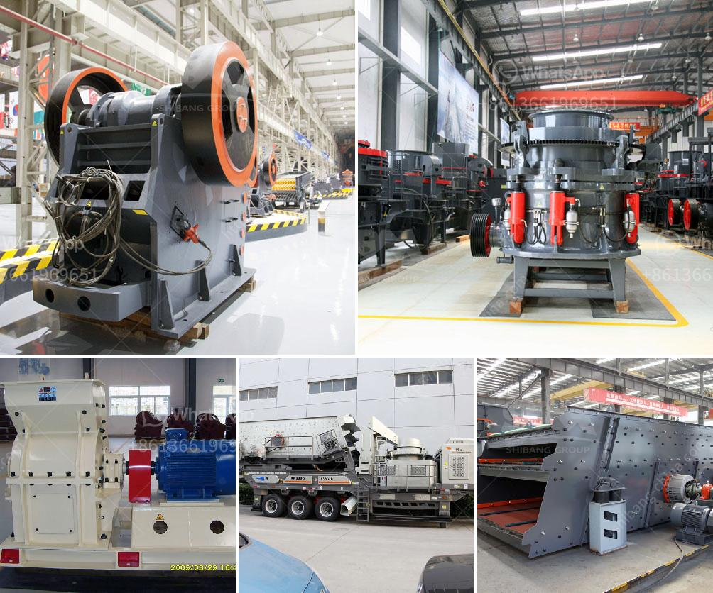

<h3>micro mill grinding mills</h3>
In recent years, the demand for smaller, more precise particle sizes in various industries has been on the rise. This has led to the development of micro mill grinding mills, which have revolutionized the manufacturing industry. With their ability to produce ultrafine particles, these grinding mills have become a game-changer, providing a cost-effective solution for manufacturers across numerous sectors.

Micro mill grinding mills are compact, highly efficient, and specifically designed to offer maximum performance in limited space. These mills utilize advanced technology and innovative features to ensure precise particle size distribution, even at microscopic levels. The result is a product that delivers superior quality and consistency, meeting the strictest industry standards.

One of the key features of micro mill grinding mills is their ability to produce extremely small particle sizes. This is accomplished through the utilization of high-speed rotating blades or hammers that impact the material, shattering it into tiny particles. These mills often incorporate air classifiers, which further refine the particles, ensuring a consistently narrow size distribution. The ability to achieve such fine particle sizes opens up a world of possibilities for manufacturers, allowing them to develop new products and enhance existing ones.

The advantages of micro mill grinding mills extend beyond particle size reduction. These mills are also highly energy-efficient, requiring less power compared to traditional grinding methods. This not only leads to cost savings but also reduces the carbon footprint, making micro mill grinding mills a sustainable choice for environmentally conscious manufacturers.

Another notable advantage of micro mill grinding mills is their versatility. These mills can handle a wide range of materials, from soft and sticky substances to hard and brittle ones. This flexibility makes them an invaluable tool for manufacturers in various industries, including pharmaceuticals, chemicals, food, cosmetics, and more. Whether it's grinding pharmaceutical powders, producing ultrafine pigments, or creating consistent particle sizes for food additives, micro mill grinding mills deliver exceptional results.

The compact design of micro mill grinding mills also makes them ideal for small-scale production or research and development settings. These mills can fit into limited spaces, allowing manufacturers to optimize their production processes, increase productivity and accuracy, and reduce waste.

Overall, micro mill grinding mills have become instrumental in enhancing manufacturing processes across a multitude of industries. With their ability to produce ultrafine particles, energy efficiency, versatility, and compact design, these mills have revolutionized the way manufacturers approach particle size reduction. By investing in micro mill grinding mills, manufacturers can unlock endless possibilities, improve product quality, and gain a competitive edge in their respective markets.
<h3>Contact us</h3><ul><li><strong>Whatsapp:&nbsp;<a href="https://wa.me/8613661969651">+8613661969651</a></strong></li><li><a href="https://swt.shibang-china.com/?git&amp;zhl&amp;micro mill grinding mills"><strong>Online Service(chat now)</strong></a></li></ul><h3>Related</h3><ul><li><a href='crusher equipment in sweden.md'>crusher equipment in sweden</a></li><li><a href='singapore mining conveyor belt supplier.md'>singapore mining conveyor belt supplier</a></li><li><a href='small capacity double roller crusher for sale.md'>small capacity double roller crusher for sale</a></li><li><a href='bentonite clay crusher for sale.md'>bentonite clay crusher for sale</a></li><li><a href='jaw bone crusher made in britain.md'>jaw bone crusher made in britain</a></li></ul>