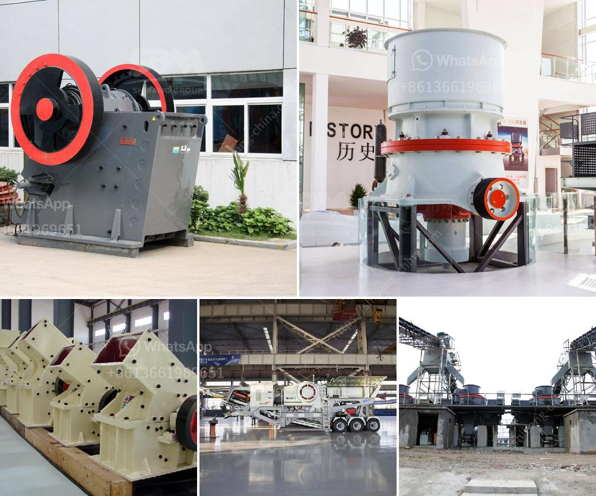

<h3>micron grinding manufacturer</h3>
Micron grinding is a crucial process in many industries, including pharmaceuticals, food processing, and chemical manufacturing. It involves reducing the size of particles to micron-scale, which allows for better product quality, enhanced solubility, and improved efficiency in various applications.

A micron grinding manufacturer plays a pivotal role in meeting the demands of these industries by providing specialized equipment and expertise in this field. These manufacturers utilize advanced technologies and state-of-the-art machinery to achieve precise and consistent micron grinding results.

One of the key benefits of working with a dedicated micron grinding manufacturer is their ability to customize the grinding process according to the specific requirements of different materials. This customization ensures optimal particle size reduction without compromising the integrity of the product. The manufacturer's expertise allows them to select the right grinding techniques, tools, and settings to achieve the desired micron-level output.

Additionally, a reputable micron grinding manufacturer ensures strict quality control throughout the grinding process. They employ stringent testing methods to ensure that the resulting particle size distribution meets the required specifications. This not only ensures uniformity in the final product but also guarantees its performance and functionality.

Working with a micron grinding manufacturer also offers cost-saving advantages. By outsourcing the grinding process to a specialized manufacturer, companies can avoid investing in expensive equipment and training. This allows them to focus on their core competencies while still benefiting from superior grinding capabilities.

In conclusion, micron grinding manufacturers are instrumental in various industries that require efficient and precise particle size reduction. Their expertise, advanced equipment, and customized processes ensure optimal grinding results and consistent product quality. Partnering with a reputable micron grinding manufacturer can lead to improved performance, reduced costs, and increased customer satisfaction.
<h3>Contact us</h3><ul><li><strong>Whatsapp:&nbsp;<a href="https://wa.me/8613661969651">+8613661969651</a></strong></li><li><a href="https://swt.shibang-china.com/?git&amp;zhl&amp;micron grinding manufacturer"><strong>Online Service(chat now)</strong></a></li></ul><h3>Related</h3><ul><li><a href='product curve jaw crusher.md'>product curve jaw crusher</a></li><li><a href='buy a roll crusher in india.md'>buy a roll crusher in india</a></li><li><a href='micro fine powder grinder.md'>micro fine powder grinder</a></li><li><a href='chinese limestone mining investors.md'>chinese limestone mining investors</a></li><li><a href='dolomite powder mill.md'>dolomite powder mill</a></li></ul>