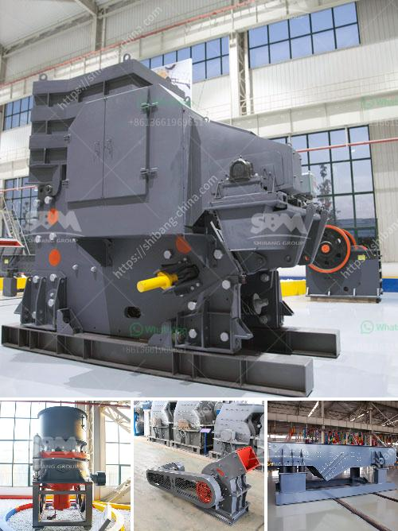

<h3>mill ore grind size passing 200 mesh</h3>
Mill ore grind size passing 200 mesh is a common requirement when it comes to mineral processing. This sizing ensures that the various minerals present in the ore are liberated and can be separated from each other to achieve the desired final product. Here, we will explore the significance of achieving this grind size and the methods employed to achieve it.

The term "mesh" refers to the number of openings per linear inch in a screen. When it comes to milling, the grind size is often specified as the percentage of particles that are able to pass through a specific mesh size. In this case, the grind size passing 200 mesh means that at least 95% of the particles are smaller than the mesh size.

The rationale behind achieving this grind size is multi-fold. Firstly, grinding the ore to a specific size allows for efficient processing downstream. By reducing the particle size, more surface area becomes available for chemical reactions or physical separations, leading to increased recovery rates and improved efficiency of mineral extraction.

Secondly, achieving an appropriate grind size is crucial to ensure that each mineral present in the ore is appropriately liberated. Many valuable minerals are embedded within the ore matrix, which can vary greatly in hardness. Grinding the ore to a specific size ensures that the individual minerals are detached from the gangue minerals or waste material, allowing for their subsequent separation.

To achieve the desired grind size, milling operations generally employ a series of crushing and grinding stages. Crushers are used to reduce the size of the ore to a manageable level, and then it is further ground in grinding mills. These mills can use various types of grinding media (such as steel balls, rods, or pebbles) to facilitate the grinding process.

The choice of the appropriate mill type and grinding media depends on several factors, including the hardness of the ore, desired grind size, and throughput requirements. Semi-autogenous (SAG) mills and ball mills are commonly used in mineral processing operations to achieve the desired grind size. Each mill type has its advantages and limitations, and their selection is typically based on the specific characteristics of the ore being processed.

Achieving the desired grind size passing 200 mesh requires careful monitoring and optimization of the grinding circuit. Ball mills and SAG mills are often operated in closed circuits with classifiers, which help control the particle size distribution in the mill product. By adjusting the variables such as the mill speed, ball size, feed rate, and classifier settings, operators can achieve the desired grind size within the specified range.

In conclusion, achieving a mill ore grind size passing 200 mesh is a crucial step in mineral processing. It allows for efficient downstream processing, enhances mineral liberation, and improves overall recovery rates. Employing the right milling equipment and optimizing the grinding circuit play a significant role in achieving this goal. Ultimately, a well-designed and well-operated milling circuit ensures that valuable minerals are extracted effectively, contributing to the success of mineral processing operations.
<h3>Contact us</h3><ul><li><strong>Whatsapp:&nbsp;<a href="https://wa.me/8613661969651">+8613661969651</a></strong></li><li><a href="https://swt.shibang-china.com/?git&amp;zhl&amp;mill ore grind size passing 200 mesh"><strong>Online Service(chat now)</strong></a></li></ul><h3>Related</h3><ul><li><a href='conveyor belts nigeria.md'>conveyor belts nigeria</a></li><li><a href='decibels declined jaw crusher hebro.md'>decibels declined jaw crusher hebro</a></li><li><a href='marble mining equipment.md'>marble mining equipment</a></li><li><a href='jaw crusher for 100x200.md'>jaw crusher for 100x200</a></li><li><a href='mobile crushers hire south africa.md'>mobile crushers hire south africa</a></li></ul>