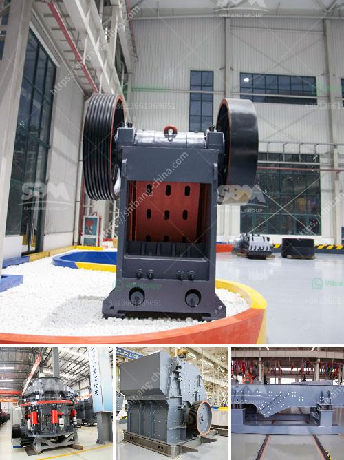

<h3>mill price of hammer mill</h3>
The mill price of a hammer mill is a very important factor when it comes to choosing the right equipment for processing raw materials into feed. Many factors determine the price of hammer mills, including the design, size, and capacity of the machine, the scale of production, and the geographical location of the manufacturer. In this article, we will explore the mill price of hammer mills, offering insights into what farmers and feed producers can expect when purchasing this equipment.

Hammer mills are versatile machines that are widely used in the agricultural and feed processing industries. They are designed to crush, grind or pulverize a variety of materials, such as grains, oilseeds, biomass, and other feed ingredients. Hammer mills are known for their efficiency, versatility, and ability to produce a consistent particle size, making them ideal for many applications.

The mill price of a hammer mill is typically influenced by its capacity or output capacity. Higher capacity machines generally have a higher price tag due to their ability to process a larger volume of material in a shorter period. It is important for buyers to consider their production needs and the scale of their operation when deciding on the appropriate capacity of the hammer mill.

Additionally, the design and construction materials of the machine can influence its price. Hammer mills are commonly made from steel, which is durable and offers excellent performance. However, the quality of steel used can vary, affecting the overall quality of the machine and its price. Some manufacturers may use cheaper materials to reduce costs, resulting in a lower price but potentially compromising the durability and performance of the hammer mill.

Geographical location also plays a role in determining the mill price of a hammer mill. Manufacturing and transportation costs can vary depending on the country or region of the manufacturer. Local manufacturing can reduce the price due to lower labor and transportation costs.

When considering the mill price of a hammer mill, it is important to look beyond the initial purchase cost. Maintenance and operational costs should also be taken into account. Some manufacturers may offer warranty and after-sales service, which can impact the long-term cost of owning and maintaining the equipment. Additionally, energy consumption should be considered as it can affect the operational costs of the hammer mill.

In conclusion, the mill price of a hammer mill depends on various factors, including the machine's capacity, design, construction materials, geographical location of the manufacturer, and additional costs such as maintenance and energy consumption. Buyers should carefully consider their production needs, budget, and long-term cost implications when selecting a hammer mill. By doing so, they can ensure they are investing in a high-quality and cost-effective machine that will meet their needs for efficient feed processing.
<h3>Contact us</h3><ul><li><strong>Whatsapp:&nbsp;<a href="https://wa.me/8613661969651">+8613661969651</a></strong></li><li><a href="https://swt.shibang-china.com/?git&amp;zhl&amp;mill price of hammer mill"><strong>Online Service(chat now)</strong></a></li></ul><h3>Related</h3><ul><li><a href='crushing machines for sale.md'>crushing machines for sale</a></li><li><a href='types of stone crusher and prices.md'>types of stone crusher and prices</a></li><li><a href='sri lanka sand washing machine prices.md'>sri lanka sand washing machine prices</a></li><li><a href='enquiry stone crusher.md'>enquiry stone crusher</a></li><li><a href='dolomite powder mesh.md'>dolomite powder mesh</a></li></ul>