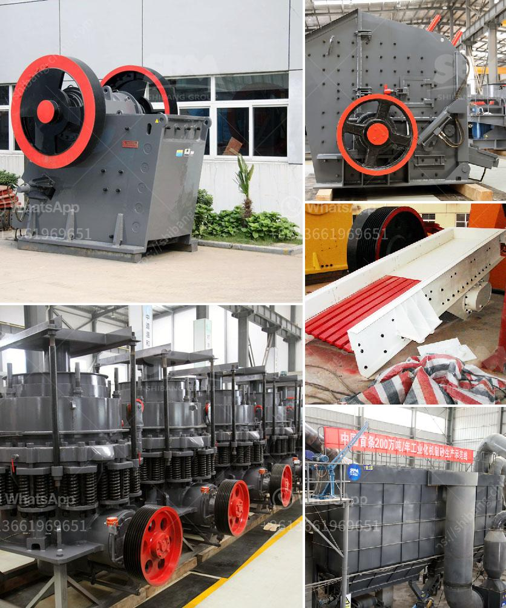

<h3>milling equipment ball mill</h3>
The ball mill is a type of grinding mill equipment used in the mining and mineral processing industry. It consists of a rotating cylindrical shell filled with grinding balls made of steel or rubber. The grinding balls are charged into the cylinder, then the mill is rotated, causing the balls to cascade and grind the ore.

Ball mills are usually used in a closed circuit with a classifier, which separates the fine particles and returns those oversize particles back to the mill for further grinding. This circuit is called the regrind circuit and allows for the efficient grinding of particles to the desired fineness.

One of the main advantages of using a ball mill is its simplicity of operation. It requires minimal maintenance and does not need complex infrastructure to operate. Additionally, ball mills are versatile and can handle both wet and dry grinding. This makes them suitable for a wide range of applications, including ore grinding, limestone grinding, and cement grinding.

In the mining industry, ball mills are used to extract valuable minerals from ores. For example, in a copper processing plant, the ore is fed into the ball mill for grinding. Smaller particles are produced by the grinding action, and these particles are mixed with water to create a slurry. The slurry is then pumped into flotation cells, where the valuable minerals are separated from the unwanted gangue.

The ball mill is also commonly used in the cement industry to grind clinker and produce cement. The final product is discharged from the mill through a discharge chute, connected to a trommel screen, which separates the grinding media from the product. The coarse material is returned to the mill for further grinding, while the fine particles are collected and stored in cement silos.

In conclusion, the ball mill is a versatile and efficient grinding mill equipment that is commonly used in the mining and cement industries. It is simple in operation, requires minimal maintenance, and can handle both wet and dry grinding. The ball mill is an essential piece of equipment in these industries, and its efficient operation contributes to the overall effectiveness of the production process.
<h3>Contact us</h3><ul><li><strong>Whatsapp:&nbsp;<a href="https://wa.me/8613661969651">+8613661969651</a></strong></li><li><a href="https://swt.shibang-china.com/?git&amp;zhl&amp;milling equipment ball mill"><strong>Online Service(chat now)</strong></a></li></ul><h3>Related</h3><ul><li><a href='coal crusher machine manufacturer in india.md'>coal crusher machine manufacturer in india</a></li><li><a href='small portable rock crushers for sale africa.md'>small portable rock crushers for sale africa</a></li><li><a href='layout design for stone crushing plant.md'>layout design for stone crushing plant</a></li><li><a href='jaw crusher vs cone crusher.md'>jaw crusher vs cone crusher</a></li><li><a href='impact hammer crusher.md'>impact hammer crusher</a></li></ul>