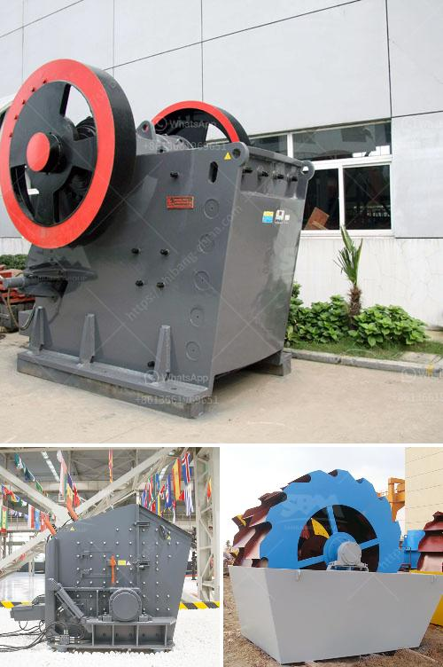

<h3>mineral grinding mill unit</h3>
A mineral grinding mill unit is a crucial element in the beneficiation process, as it enables efficient size reduction of the valuable minerals, thus resulting in increased concentration and recovery rates in subsequent stages of the ore processing.

The primary function of mineral grinding mills is to grind the ore particles from large sizes down to a more manageable size, usually in the micron or sub-micron range. This is achieved through the use of various types of grinding media, such as balls, rods, or pebbles, which are loaded into the mill and collide with the ore particles, causing them to break apart.

One of the key advantages of using a mineral grinding mill unit is its ability to achieve high grinding efficiency. The design and configuration of the mill, including the size and shape of the grinding media, the speed of rotation, and the feed and discharge arrangements, can be optimized to ensure that the maximum amount of energy is imparted to the ore particles, resulting in effective grinding.

In addition to enhancing grinding efficiency, mineral grinding mill units also offer several other benefits. They enable better control of the particle size distribution of the ground product, allowing for improved downstream processes such as flotation or leaching. Furthermore, they can help reduce the overall energy consumption in the ore processing plant by minimizing the need for subsequent stages of grinding.

Various types of mineral grinding mills are available in the market, each designed to meet specific application requirements. These range from traditional ball mills and rod mills to more advanced vertical and horizontal stirred mills, which offer higher energy efficiency and finer grinding capabilities.

In conclusion, a mineral grinding mill unit plays a crucial role in the ore processing circuit by enabling efficient size reduction of the ore particles. Its ability to achieve high grinding efficiency, control particle size distribution, and reduce energy consumption makes it an indispensable tool for maximizing productivity and profitability in the mining industry.
<h3>Contact us</h3><ul><li><strong>Whatsapp:&nbsp;<a href="https://wa.me/8613661969651">+8613661969651</a></strong></li><li><a href="https://swt.shibang-china.com/?git&amp;zhl&amp;mineral grinding mill unit"><strong>Online Service(chat now)</strong></a></li></ul><h3>Related</h3><ul><li><a href='wiring circuit of grinding machine.md'>wiring circuit of grinding machine</a></li><li><a href='concrete breakers for sale in south africa.md'>concrete breakers for sale in south africa</a></li><li><a href='continuous ball mill capacity 500 hr.md'>continuous ball mill capacity 500 hr</a></li><li><a href='calcite mining plant.md'>calcite mining plant</a></li><li><a href='suppliers of ball mill in bhopal.md'>suppliers of ball mill in bhopal</a></li></ul>