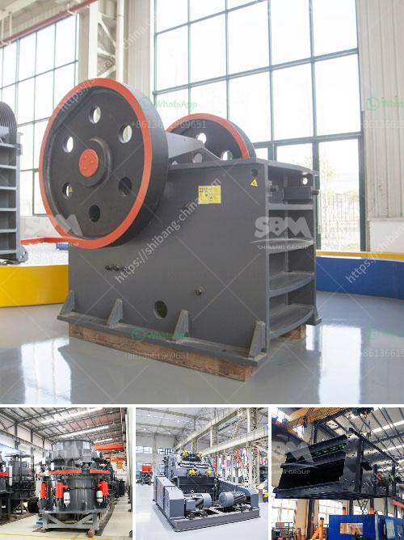

<h3>mineral grinding raymond</h3>
In the field of mineral processing, grinding plays a significant role in improving the efficiency of ore concentration and extracting valuable minerals. However, traditional grinding methods often lead to excessive energy consumption and environmental pollution. The need for a more sustainable and efficient grinding solution has led to the development of the mineral grinding Raymond mill.

Raymond mill, also known as Raymond roller mill, is a common grinding equipment widely used in various industries. It is widely used in the grinding of ore materials in metallurgy, building materials, chemical industry, mining, and other fields. With the continuous development of technology, Raymond mill has made significant progress in terms of performance, automation, energy saving, and environmental protection.

One of the major advantages of the mineral grinding Raymond mill is its high grinding efficiency. The Raymond mill uses a grinding roller assembly to apply pressure on the grinding ring tightly, thereby achieving complete grinding in one cycle. This grinding method is highly efficient and saves a significant amount of time and energy compared to traditional grinding methods.

Another advantage of the mineral grinding Raymond mill is its versatility. It can efficiently grind various non-flammable and non-explosive materials with a hardness of less than 7 and a humidity of less than 6%, such as limestone, gypsum, talc, calcite, dolomite, marble, bentonite, kaolin, phosphate rock, etc. Furthermore, the fineness can be adjusted between 80-400 mesh, which provides a wide range of options for different industries and applications.

In addition to its high efficiency and versatility, the mineral grinding Raymond mill also focuses on energy saving and environmental protection. The mill adopts advanced grinding principle and improved structure design, which can effectively reduce energy consumption. Moreover, this mill is equipped with a pulse dust collector, which can capture and collect up to 99% of the dust generated during the grinding process, significantly reducing environmental pollution.

With the increasing emphasis on sustainable development, the mineral grinding Raymond mill aligns well with the global green manufacturing initiative. It not only meets the grinding requirements of various industries but also reduces energy consumption and environmental pollution, making it an ideal choice for the mineral processing industry.

In conclusion, the mineral grinding Raymond mill is a high-efficiency and versatile grinding equipment that promotes efficient processing and sustainable development. Its high grinding efficiency, wide range of applications, energy-saving, and environmental protection features make it a preferred choice in the market. The mineral grinding Raymond mill will continue to play a vital role in the mineral processing industry, contributing to the efficient use of resources and the protection of the environment.
<h3>Contact us</h3><ul><li><strong>Whatsapp:&nbsp;<a href="https://wa.me/8613661969651">+8613661969651</a></strong></li><li><a href="https://swt.shibang-china.com/?git&amp;zhl&amp;mineral grinding raymond"><strong>Online Service(chat now)</strong></a></li></ul><h3>Related</h3><ul><li><a href='price hammer crusher nigeria.md'>price hammer crusher nigeria</a></li><li><a href='coal crusher equipment.md'>coal crusher equipment</a></li><li><a href='mining mobile crusher and washing lebanon.md'>mining mobile crusher and washing lebanon</a></li><li><a href='jaw crusher of zenith.md'>jaw crusher of zenith</a></li><li><a href='mobile stone crusher price canada.md'>mobile stone crusher price canada</a></li></ul>