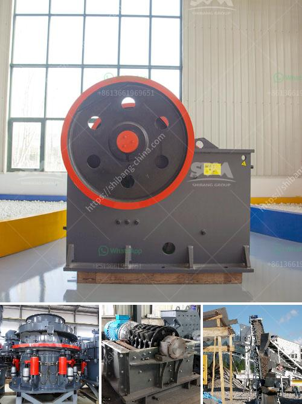

<h3>mineral hammer mill</h3>
A mineral hammer mill is a type of equipment used to crush materials into fine particles. It operates by repeatedly hitting the material with hammers, potentially causing it to break into smaller pieces. This is particularly useful for processing minerals such as coal, limestone, gypsum, and more.

The hammer mill consists of a rotating shaft with several hammers attached to it. When the material enters the chamber, it is struck by the hammers, which rotate at high speed. The impact generates force and pressure, ultimately crushing the material.

This type of mill is widely used in various industries, including mining, construction, and metallurgy. It is commonly used for grinding minerals, as it allows for greater control over the particle size. The size of the output particles can be adjusted by changing the size and number of hammers, as well as the speed of the rotor.

In addition to its grinding capabilities, a mineral hammer mill can also be used for other applications. For example, it can be utilized in recycling processes to reduce the size of waste materials, making them easier to handle and transport.

The design of the mineral hammer mill ensures durability and efficiency. The heavy-duty construction enables it to withstand the high impact and forces exerted during the crushing process. Additionally, various safety features are integrated into the machine, ensuring the protection of operators and preventing accidents.

Overall, a mineral hammer mill is a versatile machine that plays a crucial role in various industries. Its ability to reduce materials into fine particles allows for more efficient processing and utilization of resources. Whether it is grinding minerals or recycling waste materials, this equipment proves to be an invaluable tool.
<h3>Contact us</h3><ul><li><strong>Whatsapp:&nbsp;<a href="https://wa.me/8613661969651">+8613661969651</a></strong></li><li><a href="https://swt.shibang-china.com/?git&amp;zhl&amp;mineral hammer mill"><strong>Online Service(chat now)</strong></a></li></ul><h3>Related</h3><ul><li><a href='jaw crusher saudi price.md'>jaw crusher saudi price</a></li><li><a href='donesia lowongan kerja kuwait cement plant.md'>donesia lowongan kerja kuwait cement plant</a></li><li><a href='vibrating screens pictures.md'>vibrating screens pictures</a></li><li><a href='stone crusher for sale price in dubai.md'>stone crusher for sale price in dubai</a></li><li><a href='manufacturers of cement grinding units in india.md'>manufacturers of cement grinding units in india</a></li></ul>