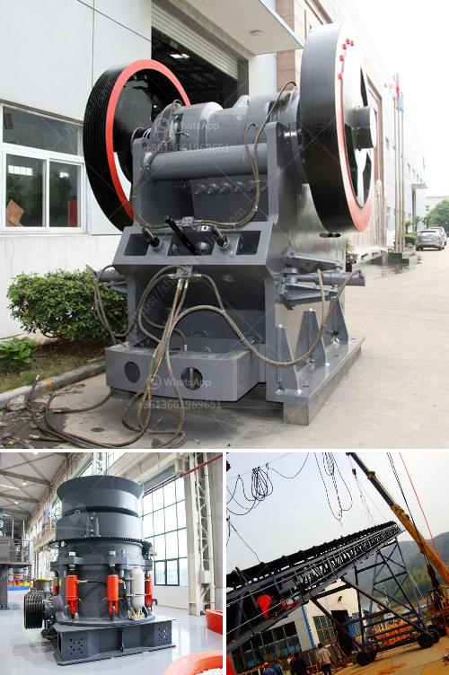

<h3>mineral quartz grinding mills in hyderabad</h3>
Quartz is a mineral that is widely utilized in various industries such as glass, ceramics, and even electronics. The popularity of quartz has been steadily increasing in recent years due to its durability, easy availability, and versatility for different applications. In order to meet the growing demand for quartz, grinding mills play a crucial role in extracting the desired size and texture of the mineral. Hyderabad, known for its manufacturing and technological advancements, has become one of the major hubs for mineral quartz grinding mills.

Hyderabad, located in the southern part of India, has a rich history in the mining industry. The region is blessed with abundant mineral resources, and quartz is one of the minerals that is found in substantial quantities. With the rise in demand for quartz, mining companies in Hyderabad have expanded their operations to ensure a steady supply of raw material to the grinding mills.

Quartz grinding mills are specialized machines that are used in the pulverization of various minerals into finer particles. These mills consist of a rotating drum that contains grinding media which significantly reduces the size of the mineral. As the drum rotates, the grinding media crushes and grinds the mineral into a powder form. The resulting powdered quartz is then further processed to meet specific requirements of different industries.

One of the most popular types of quartz grinding mills used in Hyderabad is the ball mill. This type of mill is equipped with a rotating cylinder that contains grinding media like steel or ceramic balls. The material to be ground is added to the cylinder along with the grinding media, and as the cylinder rotates, the media crushes and grinds the quartz particles, resulting in a fine powder.

Another type of quartz grinding mill commonly used in Hyderabad is the Raymond mill. This mill is characterized by its vertical structure, where the grinding roller and grinding ring are suspended vertically, creating a grinding chamber with high grinding efficiency. The quartz material is fed into the mill from the side of the grinding ring, and as the mill rotates, the centrifugal force pushes the material towards the grinding roller and ring, where it is crushed and ground into fine particles.

The mineral quartz grinding mills in Hyderabad are equipped with advanced technology and machinery that ensure efficient and precise grinding of quartz minerals. These mills are also equipped with dust collectors to minimize environmental pollution and ensure a cleaner working environment.

The growth of the quartz grinding mills industry in Hyderabad has not only contributed to the local economy but has also created job opportunities for the local workforce. The presence of these mills has attracted skilled professionals in the field of mineral processing, contributing to the overall growth of the region's manufacturing sector.

In conclusion, mineral quartz grinding mills in Hyderabad play a vital role in the extraction and processing of quartz minerals. With the increasing demand for quartz, these mills provide an efficient solution to grind the mineral into fine particles, catering to the diverse needs of various industries. The advanced technology and machinery incorporated in these mills ensure high-quality output and contribute to the overall growth of the manufacturing sector in Hyderabad.
<h3>Contact us</h3><ul><li><strong>Whatsapp:&nbsp;<a href="https://wa.me/8613661969651">+8613661969651</a></strong></li><li><a href="https://swt.shibang-china.com/?git&amp;zhl&amp;mineral quartz grinding mills in hyderabad"><strong>Online Service(chat now)</strong></a></li></ul><h3>Related</h3><ul><li><a href='mobile sand making machine.md'>mobile sand making machine</a></li><li><a href='ball mill grinding manufacturer in india.md'>ball mill grinding manufacturer in india</a></li><li><a href='crushing machines for rent in uae.md'>crushing machines for rent in uae</a></li><li><a href='sell old stone crusher.md'>sell old stone crusher</a></li><li><a href='pulverizer crusher machine for coal.md'>pulverizer crusher machine for coal</a></li></ul>