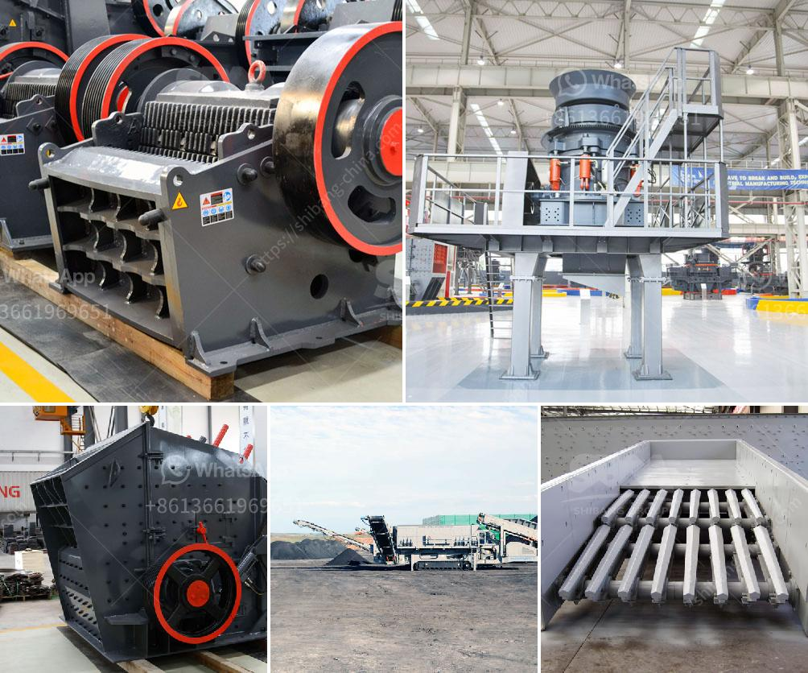

<h3>mini cement plant capacity of ton per day</h3>
A mini cement plant, also known as a small-scale cement production line, is a concept that allows for the production of cement at a lesser cost with low investment. Mini cement plants have the capacity to produce high quality cement with a daily output of 50 to 200 tons. However, they require less space and can be set up in remote areas with limited infrastructure, making them ideal for small-scale construction projects.

One of the main advantages of a mini cement plant is its low capital cost. The initial investment for setting up such a plant is significantly lower compared to traditional large-scale cement plants. This makes it more accessible for entrepreneurs and small construction companies to enter the cement manufacturing industry. The lower investment cost also implies a shorter payback period, allowing for faster returns on investment.

In addition to the low capital cost, mini cement plants have lower operating costs as well. With a smaller capacity of up to 200 tons per day, these plants require less energy and raw materials compared to larger plants. This results in reduced operational expenses, including electricity, fuel, and maintenance costs. The smaller scale of production also allows for easier monitoring and control, leading to higher efficiency and reduced wastage.

Despite their smaller size, mini cement plants are capable of producing high-quality cement that meets industry standards. These plants use the same technology employed in larger cement plants, ensuring consistent quality and performance. Advanced equipment and machinery are utilized in the process to ensure the proper blending and grinding of raw materials, resulting in a fine and durable cement product.

Another advantage of mini cement plants is their flexibility and adaptability. Being smaller in size, they can be easily relocated and set up in areas with limited infrastructure or in regions witnessing rapid growth. This decentralized approach helps meet the increasing demand for cement in local markets, especially in remote areas where transportation costs are high. Mini cement plants can also be tailored to produce specialized cement varieties based on local preferences, further enhancing their marketability.

In conclusion, a mini cement plant with a capacity of ton per day is an attractive investment opportunity in the cement manufacturing sector. The low capital cost, reduced operational expenses, and high-quality output make it an ideal choice for entrepreneurs and small construction companies. Moreover, its flexibility and adaptability allow for the production of cement in remote areas, enabling the supply of this critical building material to underserved regions. With proper planning and execution, a mini cement plant can be a profitable venture with significant potential for growth and long-term success.
<h3>Contact us</h3><ul><li><strong>Whatsapp:&nbsp;<a href="https://wa.me/8613661969651">+8613661969651</a></strong></li><li><a href="https://swt.shibang-china.com/?git&amp;zhl&amp;mini cement plant capacity of ton per day"><strong>Online Service(chat now)</strong></a></li></ul><h3>Related</h3><ul><li><a href='used crusher in tanzania.md'>used crusher in tanzania</a></li><li><a href='scale gold mining business plan.md'>scale gold mining business plan</a></li><li><a href='catalog of stone crusher production line made in iran.md'>catalog of stone crusher production line made in iran</a></li><li><a href='jaw crushers machine for sale.md'>jaw crushers machine for sale</a></li><li><a href='ball mill grinding manufacturer in india.md'>ball mill grinding manufacturer in india</a></li></ul>