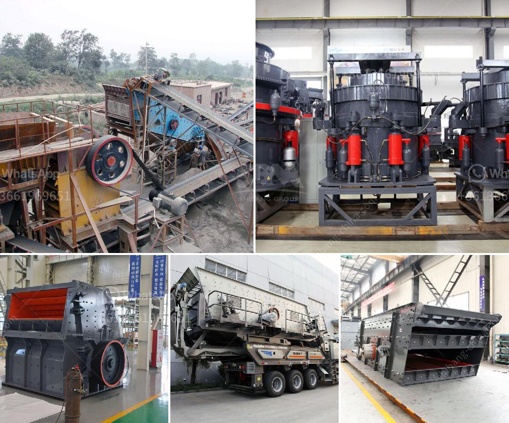

<h3>mini cement plant in west bengal</h3>
West Bengal, a state known for its rich cultural heritage and diverse industries, is witnessing a significant growth spurt in the construction sector. The demand for cement, the backbone of the construction industry, has been steadily rising, prompting the establishment of mini cement plants to cater to this increasing need. 

A mini cement plant is a small-scale production unit that plays a crucial role in meeting the cement demand of the region. The plant typically has a capacity of between 100 and 300 tons per day, considerably lower than the output of a large-scale cement plant. However, these plants are highly efficient and cost-effective, making them a viable option for small to medium-sized construction projects. 

One of the main advantages of a mini cement plant is its ability to produce cement at a lower cost. The smaller scale of operation translates into reduced capital investment, lower production costs, and lower overheads compared to larger plants. This cost advantage is often passed on to the consumers, making cement more affordable, thereby driving demand and fueling the growth of the construction sector. 

Moreover, the establishment of mini cement plants also contributes to the development of rural areas in West Bengal. These plants generate employment opportunities for the local population, stimulating economic growth and reducing the migration of labor to major cities. This localized approach not only benefits the communities but also fosters sustainable development by helping to bridge the rural-urban divide. 

The environmentally-friendly nature of mini cement plants is another noteworthy aspect. These smaller plants are built with state-of-the-art technology that ensures efficient use of resources and minimal carbon emissions. By adopting eco-friendly practices, mini cement plants contribute to the state's goal of combating climate change and promoting sustainable development. 

In conclusion, the establishment of mini cement plants in West Bengal has emerged as a boon for the construction industry. These plants not only meet the rising demand for cement but also offer cost-effective solutions, generate employment, and promote sustainable development. With West Bengal witnessing a surge in construction activities, the presence of mini cement plants is likely to play a crucial role in meeting the growing requirement of cement and fostering overall socio-economic growth in the region.
<h3>Contact us</h3><ul><li><strong>Whatsapp:&nbsp;<a href="https://wa.me/8613661969651">+8613661969651</a></strong></li><li><a href="https://swt.shibang-china.com/?git&amp;zhl&amp;mini cement plant in west bengal"><strong>Online Service(chat now)</strong></a></li></ul><h3>Related</h3><ul><li><a href='stone processing equipment in south africa.md'>stone processing equipment in south africa</a></li><li><a href='second hand mobile crushers and screens south africa.md'>second hand mobile crushers and screens south africa</a></li><li><a href='komatsu br 380 crusher for sale in malaysia.md'>komatsu br 380 crusher for sale in malaysia</a></li><li><a href='gypsum making machine.md'>gypsum making machine</a></li><li><a href='small stone brick crusher.md'>small stone brick crusher</a></li></ul>