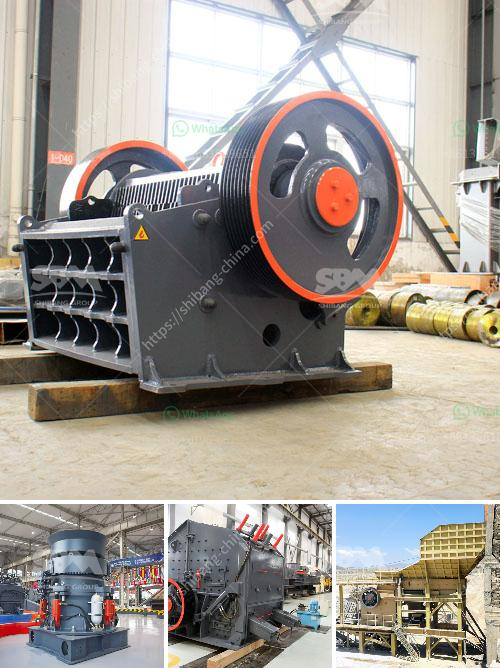

<h3>mini cement plant project report of cost setting in india</h3>
A mini cement plant project report is one that provides details on the cost of setting up a cement plant from scratch. Such a report contains the necessary information about various aspects of the project including the financial, technical, and commercial aspects, thereby helping entrepreneurs make sound investment decisions.

India is the second largest producer of cement in the world, contributing to more than 8% of the global installed capacity. With the country's growing economy and increasing infrastructure demands, the cement sector in India has witnessed significant growth over the years. This has led to the establishment of numerous cement manufacturing plants across the country to meet the rising demand.

The cost of setting up a mini cement plant varies depending on factors such as the location, size, production capacity, and available resources. It is important to note that a mini cement plant may not necessarily be a standalone unit; it may be part of a larger project. Similarly, there can be multiple mini cement plants in a single location, making it an attractive proposition for entrepreneurs.

The project report for a mini cement plant provides information on the current market scenario, cost implications, production process, and project funding. It also includes financial analysis, revenue projections, and profit and loss statements. Entrepreneurs can use this report to evaluate the feasibility of setting up a mini cement plant and understand the potential returns on investment.

In conclusion, a mini cement plant project report is an important document that highlights the cost implications of setting up a cement manufacturing plant. It provides entrepreneurs with crucial information to evaluate the feasibility of such a venture in India's growing cement industry. With careful planning and execution, a mini cement plant can emerge as a profitable business opportunity.
<h3>Contact us</h3><ul><li><strong>Whatsapp:&nbsp;<a href="https://wa.me/8613661969651">+8613661969651</a></strong></li><li><a href="https://swt.shibang-china.com/?git&amp;zhl&amp;mini cement plant project report of cost setting in india"><strong>Online Service(chat now)</strong></a></li></ul><h3>Related</h3><ul><li><a href='list of price of stone crusher machine in zimbabwe.md'>list of price of stone crusher machine in zimbabwe</a></li><li><a href='iron crusher manufacturer.md'>iron crusher manufacturer</a></li><li><a href='clay grinding plant.md'>clay grinding plant</a></li><li><a href='ball clay crusher manufacturing process.md'>ball clay crusher manufacturing process</a></li><li><a href='alluvial mobile diamond processing plant.md'>alluvial mobile diamond processing plant</a></li></ul>