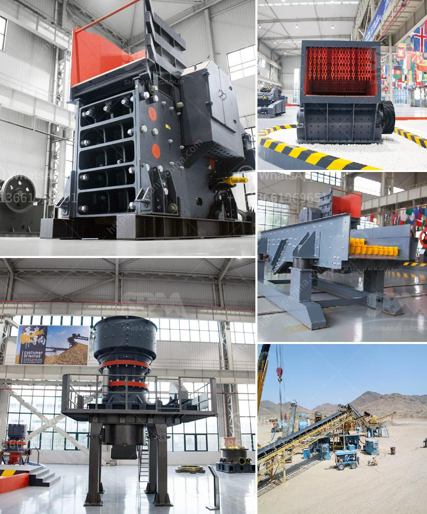

<h3>mini cement plants manufacturer africa</h3>
Mini cement plants have emerged as a viable option for businesses in Africa, offering numerous advantages over larger traditional cement manufacturing plants. These plants are compact, cost-effective, and environmentally friendly, making them a perfect solution for countries in Africa seeking to improve their infrastructure and boost economic growth.

One of the key advantages of mini cement plants is their small size, typically ranging from 30 to 100 tons per day. This compact nature allows these plants to be set up in remote areas, closer to the market, reducing transportation costs and ensuring a steady supply of cement. Moreover, the smaller size also means that these plants are easier to operate and require fewer resources, making them a feasible option for entrepreneurs and local communities.

Cost is often a major concern when it comes to cement manufacturing. Traditional large-scale plants require heavy investments, making it difficult for small and medium-sized enterprises (SMEs) to enter the industry. Mini cement plants, however, offer a cost-effective alternative that enables SMEs to compete in the market. These plants require lower capital investment, reduce operational costs, and offer higher returns on investment compared to their larger counterparts.

African countries are increasingly focused on sustainable development, and mini cement plants align perfectly with this objective. With lower energy consumption and reduced emissions, these plants have a significantly smaller carbon footprint. They also require less land for installation, minimizing environmental degradation. By embracing mini cement plants, Africa can move towards a greener and more sustainable future.

In recent years, several manufacturers in Africa have started to specialize in the production of mini cement plants. These manufacturers provide turnkey solutions, meaning they handle everything from plant design and installation to maintenance and support. Their expertise and experience ensure that businesses receive top-quality cement plants that meet international standards.

In conclusion, mini cement plants offer a practical solution for cement manufacturing in Africa. With their small size, cost-effectiveness, and sustainability, these plants present a unique opportunity for governments, entrepreneurs, and local communities to develop their infrastructure and contribute to economic growth. With the growing number of manufacturers specializing in mini cement plants in Africa, businesses can now easily access the technology and expertise needed to set up these plants efficiently.
<h3>Contact us</h3><ul><li><strong>Whatsapp:&nbsp;<a href="https://wa.me/8613661969651">+8613661969651</a></strong></li><li><a href="https://swt.shibang-china.com/?git&amp;zhl&amp;mini cement plants manufacturer africa"><strong>Online Service(chat now)</strong></a></li></ul><h3>Related</h3><ul><li><a href='stone crusher buatan indonesia.md'>stone crusher buatan indonesia</a></li><li><a href='small sand washing machine.md'>small sand washing machine</a></li><li><a href='catalog of stone crusher production line made in iran.md'>catalog of stone crusher production line made in iran</a></li><li><a href='quartz grinding ball mill.md'>quartz grinding ball mill</a></li><li><a href='used portable crusher for sale south africa.md'>used portable crusher for sale south africa</a></li></ul>