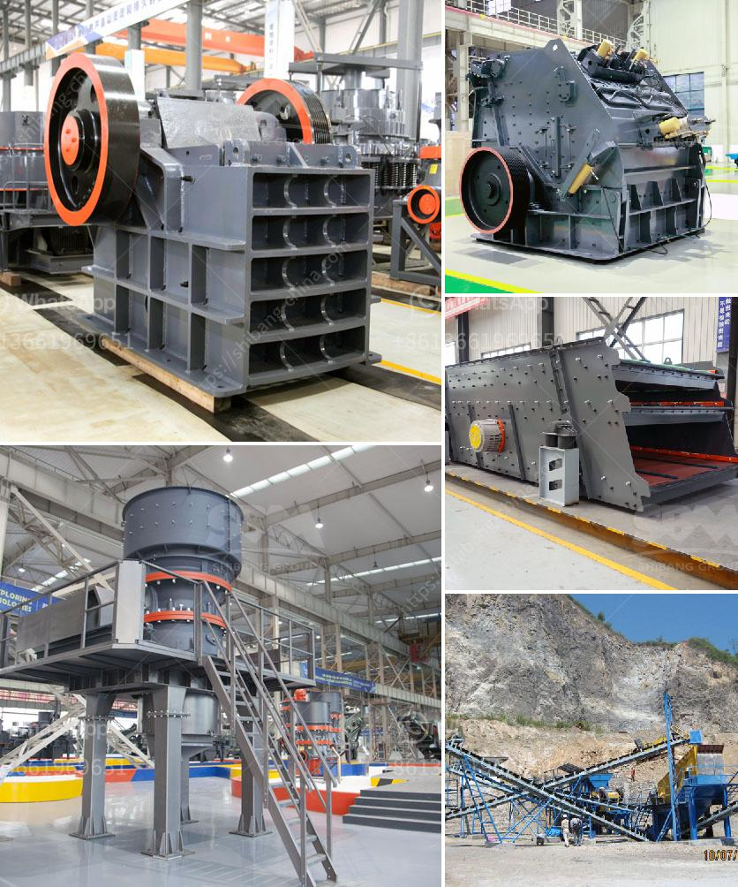

<h3>mini concrete crusher in united kingdom</h3>
The construction industry in the United Kingdom continues to grow at a rapid pace. With the need for new infrastructure projects and the ongoing renovation of older buildings, the demand for construction materials is higher than ever. One such material that is extensively used in construction is concrete. However, with the increasing amount of concrete waste being generated, it has become crucial to find sustainable and efficient ways to deal with it. This is where the mini concrete crusher comes into play.

A mini concrete crusher is a small and portable machine that is used for crushing and recycling concrete waste. This machine is incredibly cost-effective as it generates only a small amount of waste materials during its operation. The concrete crushers are equipped with replaceable crusher tips to guarantee an optimum and effective tool to take advantage of the concrete material without adding more pollution to the environment.

In recent years, the United Kingdom has witnessed a rise in construction projects. As a result, there has been a surge in the amount of concrete waste. The traditional methods of disposing of concrete waste like landfilling are not only expensive but also detrimental to the environment. Landfilled concrete not only takes up valuable space but also releases harmful chemicals into the surrounding soil and water sources. On the other hand, recycling concrete waste using a mini concrete crusher can significantly reduce the carbon footprint of the construction industry.

One of the major advantages of using a mini concrete crusher is that it can be easily transported to different construction sites. These crushers are small in size and lightweight, making them perfect for contractors who have to move from one location to another frequently. Additionally, the compact size of the crusher also allows it to access tight and narrow spaces, increasing its versatility and application range.

Another important benefit of mini concrete crushers is their ability to crush concrete into various sizes. The machine features adjustable jaws, allowing the user to control the final size of the crushed concrete. This flexibility enables the material to be reused in various construction applications such as road base, drainage layers, and even aggregate for new concrete production.

Moreover, the mini concrete crusher is incredibly user-friendly. With simple controls and intuitive operation, even individuals with minimal experience can operate the machine easily. This eliminates the need for hiring specialized operators, reducing labor costs for construction companies.

In conclusion, the mini concrete crusher has brought about a revolution in the construction industry in the United Kingdom. By providing an efficient and sustainable solution for concrete waste, it has significantly reduced the environmental impact of construction projects. With its portable and versatile design, this machine has become an indispensable tool for contractors across the country. As the construction industry continues to grow, the demand for mini concrete crushers is expected to rise steadily, ensuring a greener and more sustainable future for the United Kingdom.
<h3>Contact us</h3><ul><li><strong>Whatsapp:&nbsp;<a href="https://wa.me/8613661969651">+8613661969651</a></strong></li><li><a href="https://swt.shibang-china.com/?git&amp;zhl&amp;mini concrete crusher in united kingdom"><strong>Online Service(chat now)</strong></a></li></ul><h3>Related</h3><ul><li><a href='ball mill bekas surabayajn.md'>ball mill bekas surabayajn</a></li><li><a href='marble paving making machinry price.md'>marble paving making machinry price</a></li><li><a href='cost of cone crusher.md'>cost of cone crusher</a></li><li><a href='gypsum powder factory feasibility study.md'>gypsum powder factory feasibility study</a></li><li><a href='stone quarry crusher plant price in india.md'>stone quarry crusher plant price in india</a></li></ul>