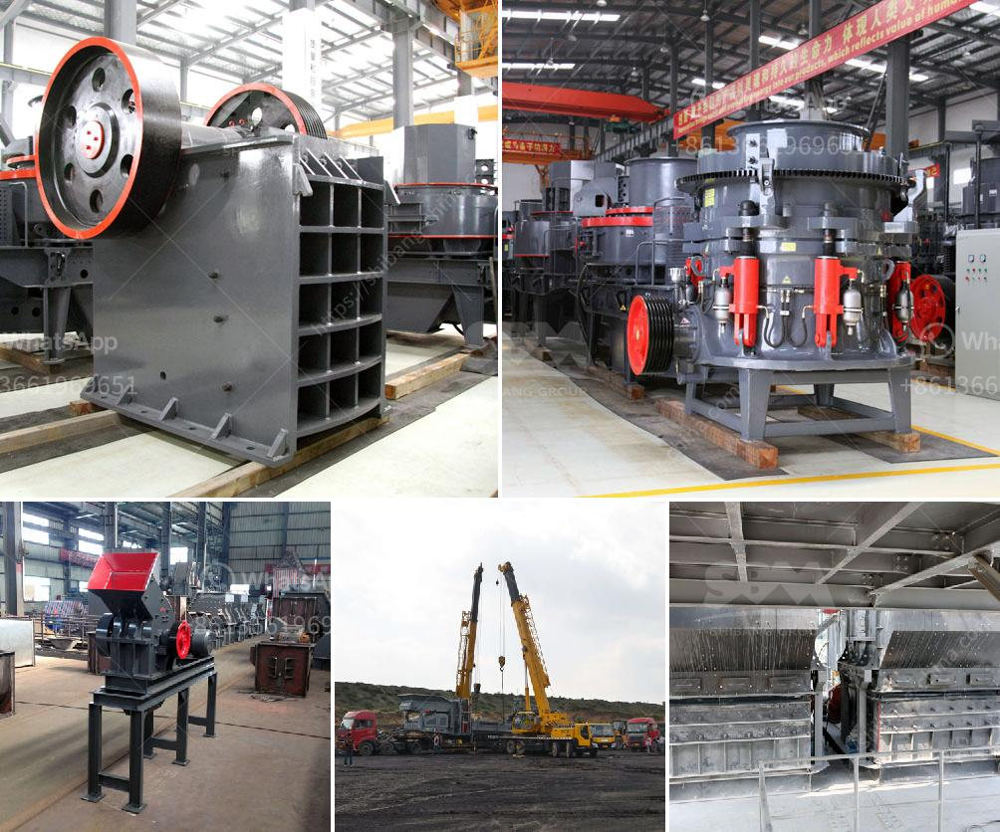

<h3>mini rock crushers for sale</h3>
Mini rock crushers are an excellent option for small-scale miners and hobbyists alike. These portable crushing machines provide a convenient and affordable way to reduce the size of rocks and stones, making them easier to transport and dispose of. While most rock crushers are designed for larger operations, Mini rock crushers offer a compact and efficient solution for smaller tasks.

Mini rock crushers are designed to handle a wide range of materials, from rocks and stones to ore and minerals. Whether you are looking to reduce the size of large rocks to gravel, or grind rocks to powder, these machines can accomplish the task with ease. Some models even have adjustable output settings, allowing you to select the desired size of the final product.

One of the advantages of mini rock crushers is their portability. Unlike larger crushers, mini rock crushers can be easily transported from one location to another. This is especially beneficial for contractors and construction workers who need to move their equipment frequently. Additionally, the compact size of mini rock crushers allows them to fit into tight spaces, making them ideal for small-scale projects or residential use.

Mini rock crushers are also incredibly easy to operate. Most models feature a simple design that requires minimal training or expertise. Even individuals with no prior experience in crushing rocks can quickly learn how to use these machines effectively. Additionally, many mini rock crushers are electrically powered, eliminating the need for manual labor.

In terms of cost, mini rock crushers are relatively affordable. While prices can vary depending on the specific model and features, most mini rock crushers are within reach of budget-conscious individuals. This makes them a popular choice for hobbyists and individuals looking to complete small-scale DIY projects.

When purchasing a mini rock crusher, it is important to consider a few key factors. First, you should determine the specific needs of your project. Consider the type and size of material you will be working with, as well as the desired size of the final product. This will help you select a mini rock crusher that is best suited to your needs.

Additionally, it is important to research and compare different models and brands before making a purchase. Look for reviews from other users and seek recommendations from industry professionals. This will ensure that you choose a reliable and high-quality mini rock crusher.

In conclusion, mini rock crushers offer a convenient and affordable solution for individuals and small-scale miners looking to crush rocks and stones. These portable machines are easy to use and transport, making them a versatile tool for a wide range of applications. Whether you are a contractor, hobbyist, or DIY enthusiast, investing in a mini rock crusher can greatly enhance your productivity and efficiency.
<h3>Contact us</h3><ul><li><strong>Whatsapp:&nbsp;<a href="https://wa.me/8613661969651">+8613661969651</a></strong></li><li><a href="https://swt.shibang-china.com/?git&amp;zhl&amp;mini rock crushers for sale"><strong>Online Service(chat now)</strong></a></li></ul><h3>Related</h3><ul><li><a href='biggest rock crusher.md'>biggest rock crusher</a></li><li><a href='silica sand mining process equipment in south africa.md'>silica sand mining process equipment in south africa</a></li><li><a href='small sand washing machine.md'>small sand washing machine</a></li><li><a href='alluvial gold mining in zimbabwe.md'>alluvial gold mining in zimbabwe</a></li><li><a href='price of conveyor belts for soaps.md'>price of conveyor belts for soaps</a></li></ul>