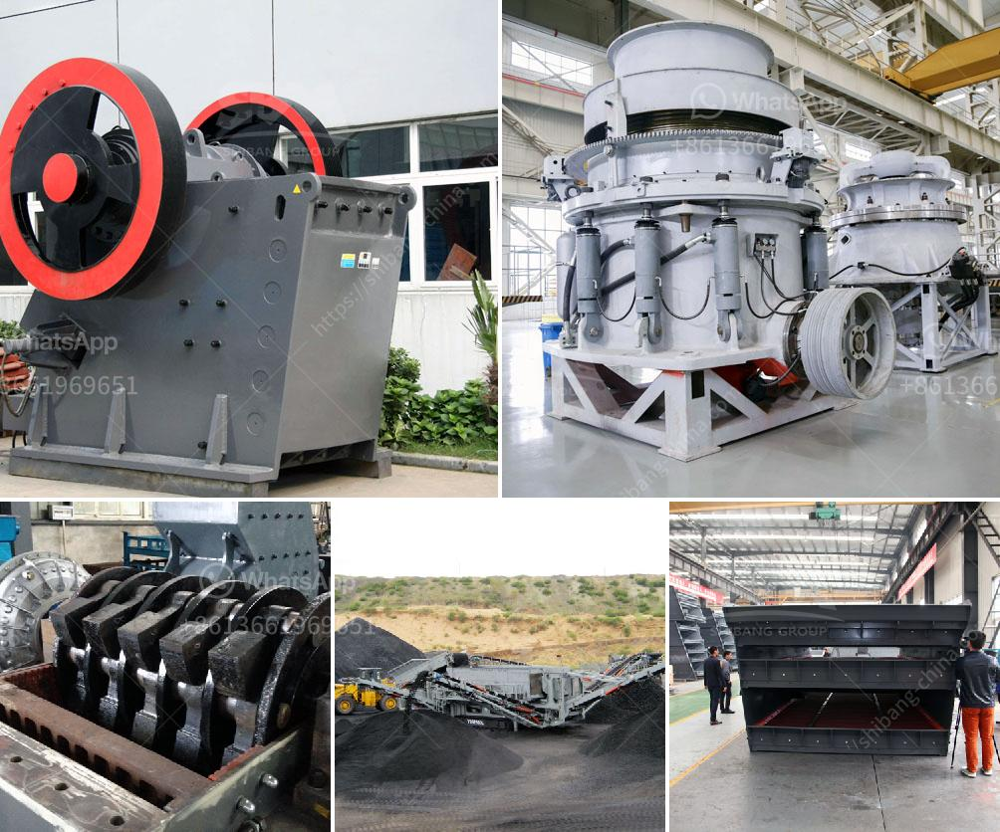

<h3>mini stone crusher machine in finland</h3>
Mini stone crusher machine, also known as small stone crusher machine, is designed for reducing the size of stones or rocks into small, usable aggregates. Its small size makes it ideal for use in homes and small quarries. With minimal maintenance requirements and fuel-efficient engines, it has become quite popular among homeowners and small-scale contractors in Finland.

The mini stone crusher machine is a versatile and efficient machine that can crush stones and rocks into smaller pieces. This machine demonstrates reliable performance coupled with a simple structure. It is composed of a crusher, a motor, a transmission mechanism, and a feeding and discharging mechanism. The machine is powered by an engine with an output power of less than 30 horsepower, making it fuel-efficient and environmentally friendly.

In Finland, where natural resources are abundantly available, the mini stone crusher machine is commonly used in small-scale mining operations. It can crush different types of materials such as rocks, marbles, granite, iron ore, and copper ore. This versatility is an advantage for users who need to crush various materials to meet their specific requirements.

One key feature of the mini stone crusher machine is its ability to process rocks, marbles, and granite into cubic-shaped aggregates. This characteristic makes it suitable for producing aggregates used in road construction, concrete production, and asphalt mixing. The finely crushed aggregates obtained from the machine can be used to build houses, railways, bridges, and other infrastructure projects. This is particularly beneficial in Finland, where the construction industry is booming.

The mini stone crusher machine is also suitable for small-scale stone crushing production lines. It can crush large stones weighing up to 30 kilograms and output gravels with a particle size of between 5 to 20 millimeters. Small jaw crushers are also available that can handle stones with a maximum size of 400 millimeters. These machines are used for crushing stones into smaller pieces to be used as construction aggregates or decorative materials.

In addition to its practicality, the mini stone crusher machine is affordable, making it accessible to small-scale contractors and homeowners in Finland. Its price may vary depending on factors such as the model and design, but it is generally more cost-effective compared to larger stone crushers. The low purchase and maintenance costs of the machine, coupled with its high productivity, make it an attractive option for many users.

To summarize, the mini stone crusher machine in Finland is a versatile and efficient machine that can process rocks, marbles, granite, iron ore, and copper ore into usable aggregates. It is powered by a fuel-efficient engine and requires minimal maintenance. This makes it popular among homeowners and small-scale contractors who need to crush stones or rocks for various purposes. Its affordability, practicality, and environmental friendliness further contribute to its popularity in Finland.
<h3>Contact us</h3><ul><li><strong>Whatsapp:&nbsp;<a href="https://wa.me/8613661969651">+8613661969651</a></strong></li><li><a href="https://swt.shibang-china.com/?git&amp;zhl&amp;mini stone crusher machine in finland"><strong>Online Service(chat now)</strong></a></li></ul><h3>Related</h3><ul><li><a href='quartz mining process in andhra pradesh types prices.md'>quartz mining process in andhra pradesh types prices</a></li><li><a href='wet and dry ball milling.md'>wet and dry ball milling</a></li><li><a href='mineral grinding raymond.md'>mineral grinding raymond</a></li><li><a href='dolomite processing plant in mexico.md'>dolomite processing plant in mexico</a></li><li><a href='limestone grinding mill unit.md'>limestone grinding mill unit</a></li></ul>