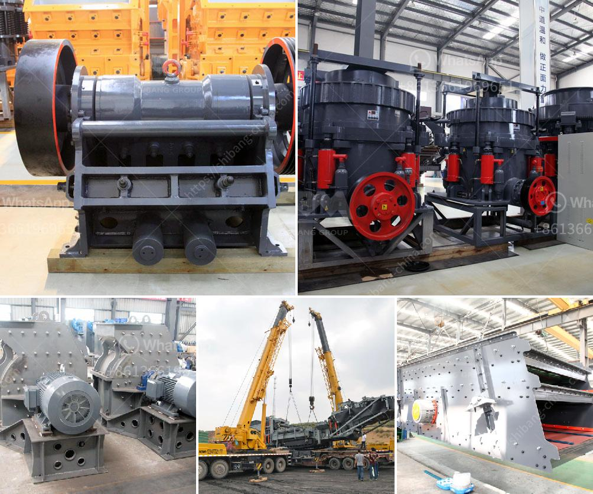

<h3>mini stone crushing machine</h3>
Stone is a natural and abundant resource, providing the materials for countless industries around the world. The demand for stone-made products is increasing, creating a lucrative market for mini stone crushing machines.

Stone crushing is a significant industry worldwide, involved in various processes such as mining, crushing, grinding, and recycling. It is essential to produce good-quality stone to meet the market demand and support infrastructure development.

However, large-scale stone crushing machines are not accessible for small-scale industries. With the introduction of mini stone crushing machines, it is now possible to carry out crushing operations even in small sites.

Small-sized stone crushing machines have the advantages of lower consumption, low operating costs, and fewer emissions. Their proclivity for processing hard stones makes them an excellent investment choice for businesses that operate in areas where labor and transportation costs are high.

1. Lower Consumption: Mini stone crushing machines are highly efficient in power consumption, making them a cost-effective option for businesses. They consume less energy compared to larger-sized crushing machines, reducing operational costs.

2. Low Operating Costs: The compact size of mini stone crushing machines allows for easy movement, reducing transportation costs significantly. They also require less maintenance, leading to lower operating costs.

3. Fewer Emissions: Mini stone crushing machines are designed with environmental concerns in mind. They emit fewer pollutants compared to larger crushing machinery, complying with strict environmental regulations.

Mini stone crushing machines are widely used in small scale stone crushing projects for quarrying, mining, recycling, and construction applications. They are typically portable and can be easily moved between job sites.

1. Quarrying: Mini stone crushing machines are used in quarries to extract aggregates and raw materials from the ground. They help to crush rocks into smaller sizes for further processing in the construction industry.

2. Mining: Mini stone crushing machines are widely employed in the mining sector for crushing limestone, granite, basalt, and other hard rocks. They can be used for primary, secondary, and tertiary crushing stages.

3. Recycling: Mini stone crushing machines play a crucial role in recycling waste materials such as concrete, asphalt, and demolition debris. They turn waste into valuable materials that can be used in new construction projects.

4. Construction: Mini stone crushing machines are ideal for construction sites with limited space. They can crush and process various construction materials, including concrete, bricks, and stones, on-site, reducing transportation costs and time.

Mini stone crushing machines are an excellent solution for small-scale industries that lack the financial resources to invest in larger-sized stone crushing machines. Mini models offer a highly efficient alternative, providing the same durable and customizable crushing capabilities in a smaller package.

Their lower energy consumption, reduced operating costs, and compliance with environmental regulations make them an attractive choice for businesses. Furthermore, their versatility allows for various applications in quarrying, mining, recycling, and construction projects.

In conclusion, mini stone crushing machines are an integral part of the stone crushing industry, providing an efficient and cost-effective solution for small-scale industries. Their benefits and applications make them a valuable asset to businesses seeking to increase productivity and profitability in the stone crushing sector.
<h3>Contact us</h3><ul><li><strong>Whatsapp:&nbsp;<a href="https://wa.me/8613661969651">+8613661969651</a></strong></li><li><a href="https://swt.shibang-china.com/?git&amp;zhl&amp;mini stone crushing machine"><strong>Online Service(chat now)</strong></a></li></ul><h3>Related</h3><ul><li><a href='buy a roll crusher in india.md'>buy a roll crusher in india</a></li><li><a href='used hammer mill.md'>used hammer mill</a></li><li><a href='difference between ball mill and roller mill.md'>difference between ball mill and roller mill</a></li><li><a href='chrome lead ore vsi crusher manufacturer.md'>chrome lead ore vsi crusher manufacturer</a></li><li><a href='gypsum stone crusher.md'>gypsum stone crusher</a></li></ul>