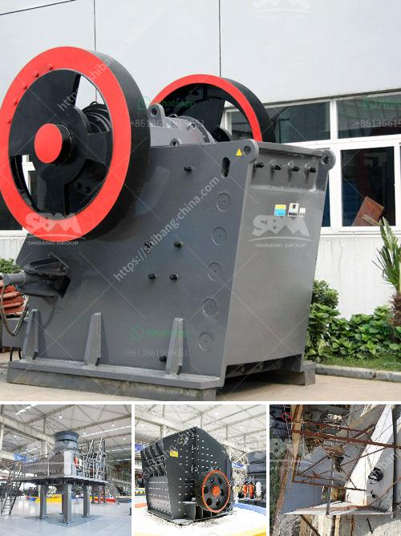

<h3>mini track jaw crushers for sale</h3>
Mini track jaw crushers are a versatile solution for all crushing needs. These highly efficient machines are ideal for recycling materials such as asphalt, concrete, construction waste, and demolition debris. The compact size, ease of transport, quick set-up times, and flexible configuration options make them a perfect choice for small to medium-sized construction projects.

One of the key features of mini track jaw crushers is their ability to crush materials directly on-site, eliminating the need for expensive transportation and disposal costs. With a mini track jaw crusher, materials can be crushed right at the job site, reducing the need to haul them to a central processing facility. This not only saves time but also reduces environmental impact.

Another advantage of mini track jaw crushers is their compact size. These crushers are designed to fit into tight spaces and can easily maneuver through narrow entrances, alleys, and job sites with limited access. They can be transported on a standard trailer, making them easy to move from one location to another.

Mini track jaw crushers are also known for their quick set-up times. These machines can be operational within minutes, allowing contractors to start crushing materials immediately. This is particularly beneficial for projects with tight deadlines or time constraints.

Additionally, mini track jaw crushers offer flexible configuration options. They can be equipped with various features such as vibrating grizzly feeders, side discharge conveyors, and magnet separators. These add-ons enhance machine efficiency and productivity, enabling contractors to process different types of materials with ease.

In conclusion, mini track jaw crushers are an excellent investment for any construction project. They offer a cost-effective and environmentally friendly solution for crushing materials on-site. With their compact size, quick set-up times, and flexible configuration options, these machines are highly versatile and can adapt to various job site requirements. Whether it's recycling asphalt, concrete, or demolition debris, mini track jaw crushers are the go-to choice for contractors looking to maximize efficiency and reduce operational costs.
<h3>Contact us</h3><ul><li><strong>Whatsapp:&nbsp;<a href="https://wa.me/8613661969651">+8613661969651</a></strong></li><li><a href="https://swt.shibang-china.com/?git&amp;zhl&amp;mini track jaw crushers for sale"><strong>Online Service(chat now)</strong></a></li></ul><h3>Related</h3><ul><li><a href='feldspar mining process.md'>feldspar mining process</a></li><li><a href='drawing for sand washing machines crusher mill.md'>drawing for sand washing machines crusher mill</a></li><li><a href='clay processing techniques.md'>clay processing techniques</a></li><li><a href='ball mill 5 tonnes.md'>ball mill 5 tonnes</a></li><li><a href='dolomite powder mesh.md'>dolomite powder mesh</a></li></ul>