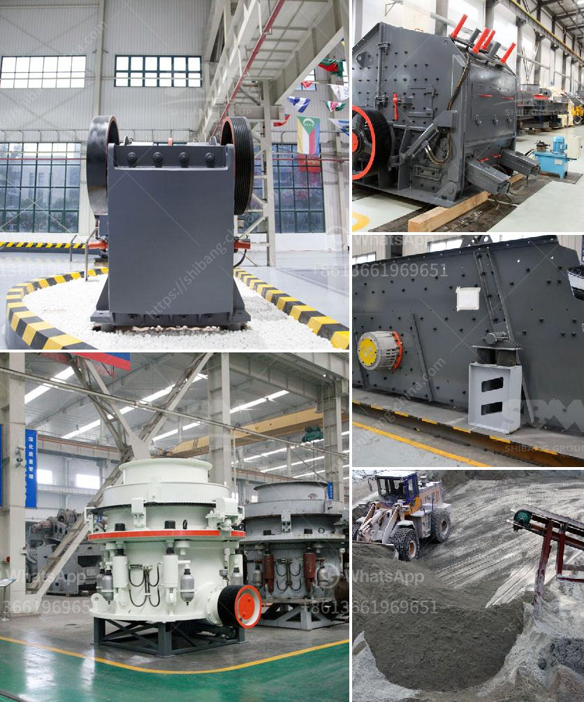

<h3>minimum output size in jaw crusher</h3>
The jaw crusher is commonly used in mining, building materials, chemical industry, metallurgy, and other industries. It is one of the main equipment for crushing medium and coarse ores or stones. It has the advantages of reliable performance, convenient operation, and strong crushing capacity. The minimum output size of the jaw crusher determines the overall efficiency of the crushing process. Here, we will analyze the factors affecting the jaw crusher output and propose possible solutions.

The output size of the jaw crusher is determined by the size of the discharge port, the discharge port should be smaller than the size of the material entering the crusher. In order to ensure the quality and efficiency of the crushing process, the smaller the output size, the better. However, achieving a minimum output size requires more power and also affects the production capacity of the crusher.

There are several factors that affect the output size of the jaw crusher. Firstly, the hardness of the material. The harder the material is, the more difficult it is to crush, and the higher the required crushing power. Secondly, the composition of the material. Different materials have different composition ratios, which affects the crushing process and output size. Thirdly, the feeding method. The feeding method affects the material distribution in the crushing cavity, which in turn affects the crushing efficiency and output size.

To achieve a minimum output size in a jaw crusher, the following solutions can be considered. Firstly, choose a suitable jaw crusher model. Different jaw crushers have different output sizes. Users should choose a jaw crusher model that matches their specific requirements. Secondly, adjust the discharge port. By adjusting the discharge port, the output size can be controlled within a certain range. However, it should be noted that excessively small discharge ports may cause blockage or even damage the equipment. Therefore, it is necessary to find a balance between output size and equipment safety.

Thirdly, increase the crushing capacity. In order to achieve a minimum output size, increasing the crushing capacity of the jaw crusher can be considered. This can be achieved by improving the structural design, increasing the power of the motor, or optimizing the crushing process. However, increasing the crushing capacity may also increase the energy consumption and maintenance cost of the equipment.

In conclusion, the minimum output size of a jaw crusher is determined by various factors such as material hardness, composition, and feeding method. Achieving a minimum output size requires careful selection of the jaw crusher model, adjustment of the discharge port, and improvement of the crushing capacity. It is important to find a balance between output size, crushing efficiency, and equipment safety. Only by considering these factors comprehensively can we achieve the desired crushing effect and maximize the efficiency of the crushing process.
<h3>Contact us</h3><ul><li><strong>Whatsapp:&nbsp;<a href="https://wa.me/8613661969651">+8613661969651</a></strong></li><li><a href="https://swt.shibang-china.com/?git&amp;zhl&amp;minimum output size in jaw crusher"><strong>Online Service(chat now)</strong></a></li></ul><h3>Related</h3><ul><li><a href='ball mill supplier in malaysia pakistan.md'>ball mill supplier in malaysia pakistan</a></li><li><a href='hard rock pulverizer crusher.md'>hard rock pulverizer crusher</a></li><li><a href='impact crusher 500tph spcfication.md'>impact crusher 500tph spcfication</a></li><li><a href='ballast crushing machinery.md'>ballast crushing machinery</a></li><li><a href='used sand wash plant for sale in texas.md'>used sand wash plant for sale in texas</a></li></ul>