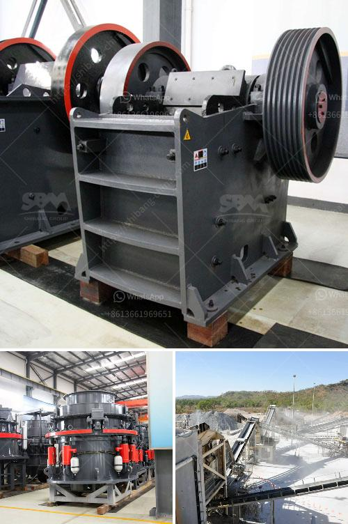

<h3>mining equipment companies in nigeria</h3>
Mining is a vast industry in Nigeria. With a population of over 180 million people, it is easy to see how the industry can cater to the various needs of the enormous population. Nigeria is blessed with a variety of mineral resources, such as limestone, tin, coal, gold, and many more. This has made mining a very lucrative business for investors in the country.

Mining equipment plays a vital role in enhancing the efficiency and productivity of mining operations in Nigeria. The country is rich in mineral resources, making it a top choice for mining companies around the world. However, mining in Nigeria comes with its challenges. One major challenge in the mining industry is the lack of adequate mining equipment.

To address this challenge, several mining equipment companies in Nigeria have emerged. These companies specialize in the supply of equipment such as excavators, dump trucks, drilling machines, crushers, and other heavy-duty machinery used in mining operations.

One prominent mining equipment company in Nigeria is Panafrican Equipment Nigeria Ltd. This company offers innovative solutions in the areas of construction, mining, and power systems. Panafrican Equipment Nigeria Ltd provides a wide range of equipment and services to cater to the needs of the mining industry. They have a team of highly trained professionals who ensure that their equipment is durable, reliable, and efficient.

Another notable mining equipment company in Nigeria is Agropet Nigeria Limited. This company specializes in the supply of mining equipment, exploration services, and mineral trading. Agropet Nigeria Limited focuses on providing complete mining solutions for clients in the mining industry. They offer equipment such as crushers, drilling machines, conveyor systems, and drilling accessories.

Dantata & Sawoe Construction Company Nigeria Limited is another mining equipment company that deserves recognition. This company specializes in the provision of mining services, construction, and equipment leasing. With over 40 years of experience in the industry, Dantata & Sawoe Construction Company Nigeria Limited has successfully executed numerous mining projects in Nigeria.

In addition to these companies, there are many other mining equipment companies in Nigeria that play significant roles in enhancing the mining industry. These companies provide mining solutions such as equipment sales, maintenance, and repair services. They also offer training programs to ensure that operators are skilled in handling the equipment safely and efficiently.

The presence of these mining equipment companies in Nigeria has greatly improved the efficiency and productivity of mining operations in the country. They have provided modern and technologically advanced equipment that can handle the demands of the industry. Furthermore, the availability of equipment maintenance and repair services ensures that downtime is minimized, leading to increased productivity.

In conclusion, mining equipment companies in Nigeria have played a significant role in revolutionizing the mining industry. These companies have not only provided equipment but also services that enhance the efficiency and productivity of mining operations. With the growing demand for mineral resources in Nigeria, the importance of mining equipment companies cannot be overstated.
<h3>Contact us</h3><ul><li><strong>Whatsapp:&nbsp;<a href="https://wa.me/8613661969651">+8613661969651</a></strong></li><li><a href="https://swt.shibang-china.com/?git&amp;zhl&amp;mining equipment companies in nigeria"><strong>Online Service(chat now)</strong></a></li></ul><h3>Related</h3><ul><li><a href='coal crushing suppliers in durban.md'>coal crushing suppliers in durban</a></li><li><a href='stone crusher in inda or parkistan.md'>stone crusher in inda or parkistan</a></li><li><a href='mobile crushing station.md'>mobile crushing station</a></li><li><a href='stone crusher plant price.md'>stone crusher plant price</a></li><li><a href='ultrafine ball mills machine.md'>ultrafine ball mills machine</a></li></ul>