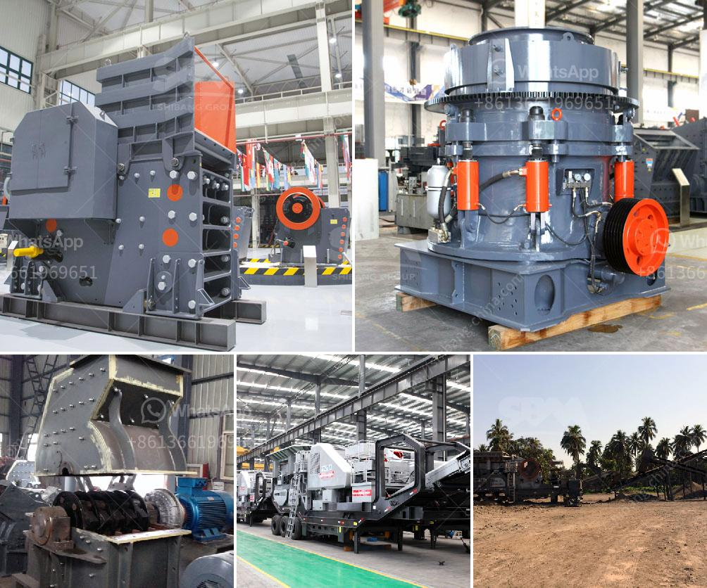

<h3>mining equipment used in mining industry</h3>
Mining is a crucial industry that involves the extraction of valuable minerals or other geological materials from the earth. To accomplish this, mining companies heavily rely on advanced equipment that can withstand the harsh conditions and deliver efficient and productive results.

One essential tool used in mining is the drill. Drills come in various sizes and designs to penetrate the earth's surface and reach the desired mineral deposits. Rotary drills are commonly used in open-pit mining operations, while underground mining requires the use of underground drill rigs. These rigs are equipped with powerful hydraulic, pneumatic, or electric drilling mechanisms, allowing them to create holes for blasting or exploration purposes.

Another vital equipment employed in mining is the excavator. Excavators are heavy machines that are often used to remove overburden or debris to expose the mineral deposits. With their bucket attachments, excavators can efficiently load and transport the extracted materials to different locations. Excavators come in different sizes, depending on the scale of the mining operation, and are capable of operating in challenging terrains.

To transport the extracted minerals or materials, mining companies employ huge haul trucks. These trucks are designed to carry tons of payload and can navigate through rough terrains found in mining sites. Equipped with powerful engines and robust suspensions, haul trucks ensure a smooth and efficient transportation process.

Mining also requires effective material processing equipment such as crushers, screens, and sorters. Crushers break down large rocks into smaller, more manageable sizes, while screens separate materials based on their size or shape. Sorters analyze materials and separate them based on their composition or quality, enabling mining companies to extract the most valuable minerals.

Furthermore, safety is of utmost importance in the mining industry. Protective gears such as helmets, goggles, gloves, and safety shoes are essential for miners to prevent accidents and injuries. Advanced monitoring systems and ventilation equipment are also used to maintain a safe working environment underground.

In conclusion, mining equipment plays a critical role in the mining industry by extracting valuable minerals from the earth. From drills and excavators to haul trucks and material processing equipment, these tools make mining operations more efficient and productive. Moreover, safety measures and protective equipment ensure the well-being of miners working in challenging and hazardous conditions. As technology continues to evolve, the mining industry can expect further advancements in equipment that will enhance productivity and safety even further.
<h3>Contact us</h3><ul><li><strong>Whatsapp:&nbsp;<a href="https://wa.me/8613661969651">+8613661969651</a></strong></li><li><a href="https://swt.shibang-china.com/?git&amp;zhl&amp;mining equipment used in mining industry"><strong>Online Service(chat now)</strong></a></li></ul><h3>Related</h3><ul><li><a href='jaw rock crusher for sale.md'>jaw rock crusher for sale</a></li><li><a href='estimate cost simple stone crusher plant.md'>estimate cost simple stone crusher plant</a></li><li><a href='basalt rock crusher suppliers in dubai.md'>basalt rock crusher suppliers in dubai</a></li><li><a href='cement cement grinding ball mill.md'>cement cement grinding ball mill</a></li><li><a href='low cost roller mill suppliers india.md'>low cost roller mill suppliers india</a></li></ul>