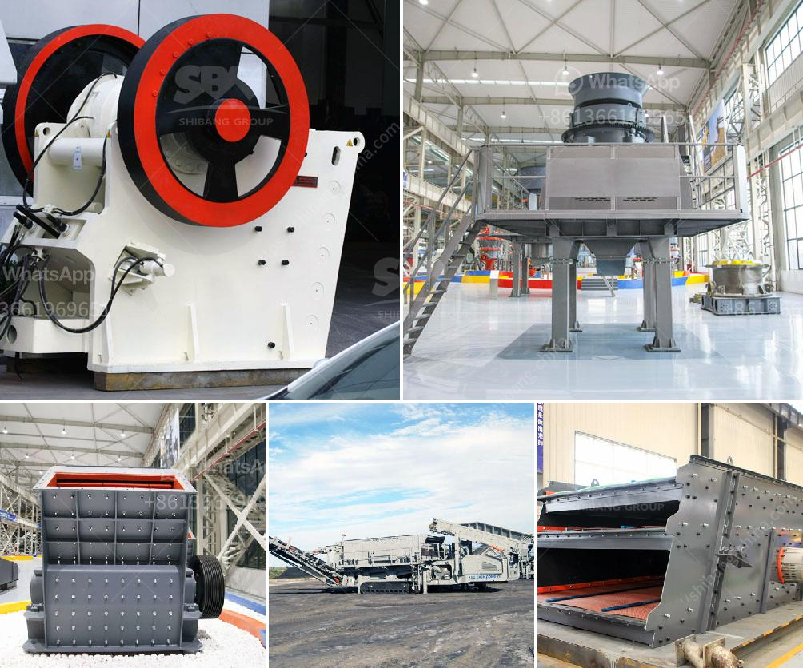

<h3>mining mobile crusher and washing lebanon</h3>
In the world of mining, efficiency is of utmost importance. Whether it is extracting minerals or processing them into usable materials, the ability to do so quickly and effectively is essential. This is where mining mobile crushers and washing systems come into play, particularly in Lebanon.

Mobile crushers are compact and highly efficient machines designed to crush rocks and minerals into smaller sizes. They can be installed directly on site, allowing for quick and convenient transportation. These crushers are equipped with advanced technology that ensures high productivity, low operating costs, and minimal environmental impact.

Lebanon, known for its rich mineral resources, has witnessed a surge in mining activities in recent years. The use of mobile crushers has become increasingly popular due to their ability to streamline the mining process. Instead of using multiple machines, mobile crushers can handle a variety of tasks, from primary crushing to final product sizing. This not only saves time but also reduces the need for additional equipment and manpower.

Washing systems are another vital component of the mining process. After the minerals have been crushed, they need to be cleaned to remove impurities and ensure a high-quality end product. Mobile washing plants, specifically designed for mining operations, are equipped with water jets and screens that effectively wash and classify the materials. These systems are highly adaptable, allowing for the processing of various types of minerals, from coal to limestone, and everything in between.

In Lebanon, where water scarcity is a concern, mobile washing systems offer an eco-friendly alternative. Their closed-circuit design and recycling capabilities minimize water consumption and waste generation, making them an ideal choice for sustainable mining practices.

The combination of mobile crushers and washing systems provides an efficient and cost-effective solution for mining operations in Lebanon. These machines enhance productivity, reduce operational costs, and promote environmental sustainability. Moreover, their mobility and adaptability make them suitable for both small-scale and large-scale mining projects.

As the demand for minerals continues to grow, so does the need for efficient mining equipment. Mobile crushers and washing systems stand at the forefront of this revolution, offering a modern and effective solution to meet the challenges of the mining industry in Lebanon.
<h3>Contact us</h3><ul><li><strong>Whatsapp:&nbsp;<a href="https://wa.me/8613661969651">+8613661969651</a></strong></li><li><a href="https://swt.shibang-china.com/?git&amp;zhl&amp;mining mobile crusher and washing lebanon"><strong>Online Service(chat now)</strong></a></li></ul><h3>Related</h3><ul><li><a href='river stone crushing plant for sale.md'>river stone crushing plant for sale</a></li><li><a href='stone crushing machine in dubai.md'>stone crushing machine in dubai</a></li><li><a href='mobile crusher morocco price.md'>mobile crusher morocco price</a></li><li><a href='smallest gold crushing and washing plant.md'>smallest gold crushing and washing plant</a></li><li><a href='vertical raw mill industry.md'>vertical raw mill industry</a></li></ul>