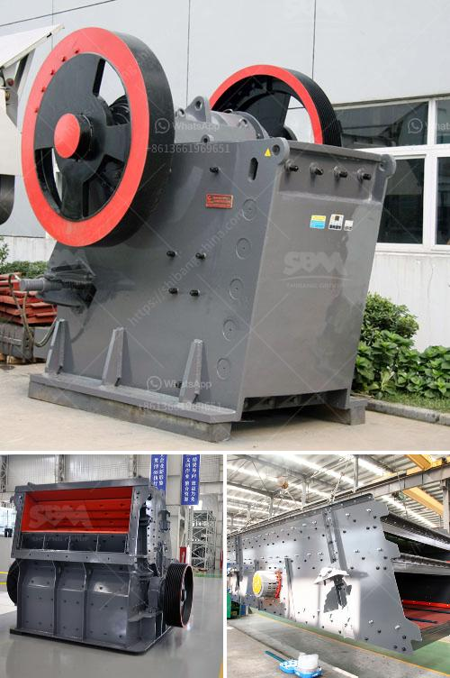

<h3>mining of copper crusher in sudan</h3>
The mining industry is considered to be one of the fastest-growing economies in Sudan. With the country's rich resources of gold, silver, iron ore, copper, and other base metals, Sudan is considered to be a great opportunity for the mining industry. On a positive note, the presence of these resources opens up possibilities for international mining companies to harness these resources for the benefit of their own economies.

One of the minerals that can be found in Sudan is copper. Copper mining in Sudan is mainly used for the production of copper cathode. Copper cathode is a form of copper that has a purity of 99.95%. In order to obtain this purity level, copper ore is mined from the copper mine and then processed through a crushing and screening plant to produce a copper concentrate.

Copper concentrate is the refined copper from the copper ore. It is used as a raw material in the production of copper cathode. Gold, silver, and other precious metals are also extracted during the copper mining process.

There are two main types of copper mining in Sudan: open-pit mining and underground mining. Open-pit mining is the most common method used, which involves digging a large quarry-like pit to extract copper ore. This leaves large craters and scars on the land, which is detrimental to the environment.

On the other hand, underground mining is less damaging to the environment as it involves tunneling underground to extract copper ore without disturbing the surface. However, underground mining can be more expensive and requires more advanced machinery and technology.

In recent years, Sudan has seen an increase in copper mining operations, especially from international mining companies. These companies have invested heavily in the mining sector of Sudan and are using advanced extraction techniques to maximize the mining output.

In conclusion, copper mining in Sudan is a lucrative business venture and an ideal investment opportunity for international mining companies. The presence of these resources, particularly copper, has the potential to boost the country's economy and improve the quality of life for the people of Sudan. However, it is important for these mining companies to adopt sustainable and environmentally friendly mining practices to minimize the negative impact on the environment.
<h3>Contact us</h3><ul><li><strong>Whatsapp:&nbsp;<a href="https://wa.me/8613661969651">+8613661969651</a></strong></li><li><a href="https://swt.shibang-china.com/?git&amp;zhl&amp;mining of copper crusher in sudan"><strong>Online Service(chat now)</strong></a></li></ul><h3>Related</h3><ul><li><a href='machine for limestone river gravel stone.md'>machine for limestone river gravel stone</a></li><li><a href='sand making machine manufacturers.md'>sand making machine manufacturers</a></li><li><a href='renting of screens and crushers.md'>renting of screens and crushers</a></li><li><a href='price of large jaw crusher.md'>price of large jaw crusher</a></li><li><a href='conventional stone crushers in peru.md'>conventional stone crushers in peru</a></li></ul>