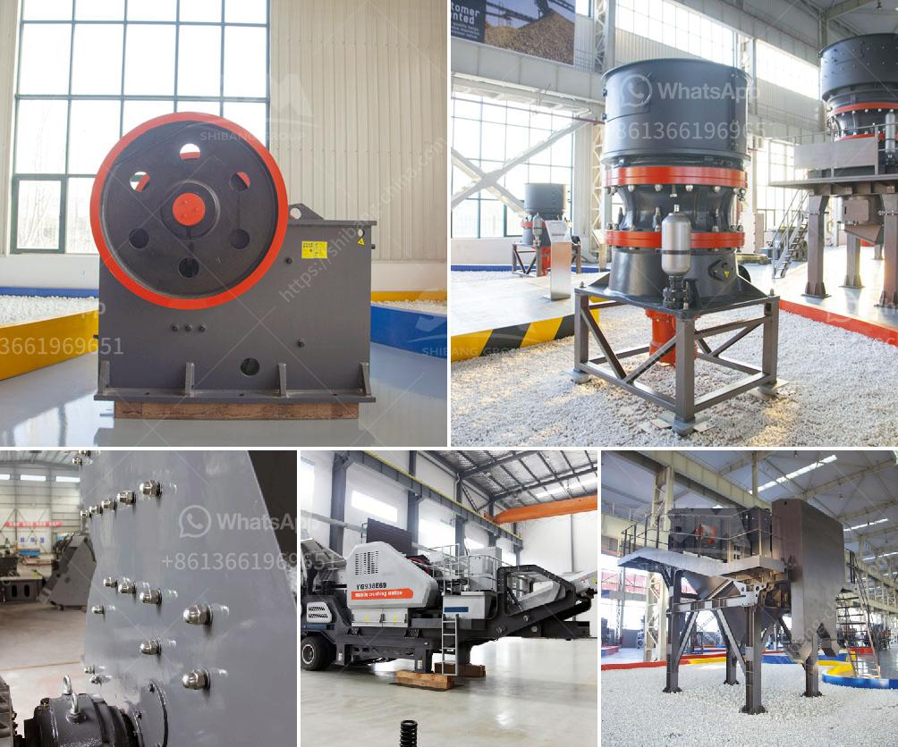

<h3>mining plant for sale harare zimbabwe</h3>
Harare, the capital city of Zimbabwe, is a hub for various economic activities, including mining operations. With its rich mineral resources and a favorable mining environment, Zimbabwe has attracted numerous investors and mining companies. If you are looking to invest in the mining industry or expand your existing mining operations, Harare offers various mining plants for sale that could meet your requirements.

One of the key advantages of investing in a mining plant in Harare, Zimbabwe is the presence of abundant mineral resources. The country is known for its vast reserves of gold, platinum, diamonds, coal, and other minerals. The mining industry has been a significant contributor to Zimbabwe's economy, generating employment opportunities and increasing foreign exchange earnings.

When searching for a mining plant for sale in Harare, it is essential to consider the size and capacity of the plant. Depending on your specific needs, you can find mining plants ranging from small-scale operations to large-scale, fully integrated mining facilities. Smaller plants typically cater to artisanal and small-scale mining operations, while larger plants are suitable for industrial-scale mining projects.

Another crucial aspect to consider is the efficiency and productivity of the mining plant. Investing in a technologically advanced plant equipped with modern machinery and equipment can significantly enhance productivity and maximize returns. Harare offers a diverse range of mining plants that incorporate the latest technologies, ensuring efficient and cost-effective operations.

Furthermore, the location of the mining plant is an important factor to evaluate. Harare's proximity to various mining sites and transportation infrastructure ensures easy access to mineral deposits and enables efficient transportation of the mined resources to processing facilities and export hubs. The strategic location of Harare makes it an ideal destination for setting up a mining plant.

In addition to these factors, it is crucial to consider the legal and regulatory framework surrounding the mining industry in Zimbabwe. The country has witnessed significant reforms in recent years, aimed at attracting more investment and streamlining the mining sector. It is important to ensure that the mining plant you choose complies with all the necessary licenses, permits, and regulations to operate legally and ethically in Zimbabwe.

Moreover, Harare offers a supportive business environment with various amenities and services required for smooth mining operations. The city boasts a well-developed infrastructure, including reliable power supply, water resources, and telecommunication networks. Additionally, Harare's skilled labor force and professional services sector provide adequate support for mining plant operations.

In conclusion, Harare, Zimbabwe, presents lucrative opportunities for investing in a mining plant. The abundance of mineral resources, favorable legal framework, and supportive business environment make it an attractive destination for mining operations. Whether you are a small-scale miner or a large mining company, there are numerous mining plants available for sale in Harare that can cater to your specific needs. By considering factors such as plant size, efficiency, location, and compliance with regulations, you can make a wise investment decision and tap into Zimbabwe's rich mining potential.
<h3>Contact us</h3><ul><li><strong>Whatsapp:&nbsp;<a href="https://wa.me/8613661969651">+8613661969651</a></strong></li><li><a href="https://swt.shibang-china.com/?git&amp;zhl&amp;mining plant for sale harare zimbabwe"><strong>Online Service(chat now)</strong></a></li></ul><h3>Related</h3><ul><li><a href='marble jaw crusher.md'>marble jaw crusher</a></li><li><a href='used crusher plant in uae.md'>used crusher plant in uae</a></li><li><a href='mineral quartz grinding mills in hyderabad.md'>mineral quartz grinding mills in hyderabad</a></li><li><a href='sand hand bentonite grinding mill.md'>sand hand bentonite grinding mill</a></li><li><a href='ballast processing plant.md'>ballast processing plant</a></li></ul>