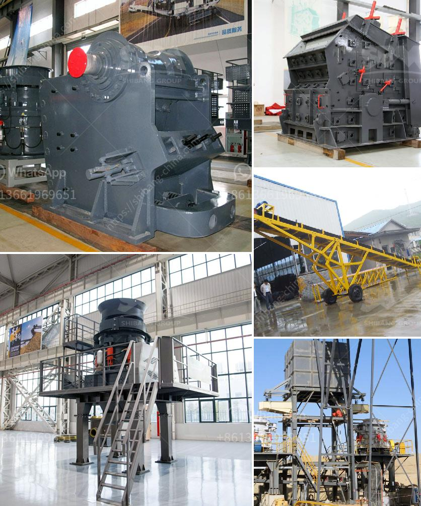

<h3>mining process of marble</h3>
The mining process of marble is not as straightforward as some might think. As pristine and visually appealing as marble may appear, extracting it from the earth can be a complex and arduous process. There are several steps involved, each with its unique challenges.

The first step in mining marble is finding a suitable deposit. This may require extensive research and geological surveys to identify regions with potential marble reserves. Once a deposit is located, the area needs to be cleared of any vegetation and prepared for excavation.

Excavation begins with the use of heavy machinery, such as diamond wire saws, large drills, and explosives. The goal is to create a series of vertical and horizontal cuts in the marble block. These cuts allow the marble to be extracted in smaller, manageable pieces. Care must be taken during this process to minimize any damage to the marble's surface.

After extraction, the marble blocks need to be transported to a processing plant. This can involve loading them onto trucks, trains, or even barges, depending on the location of the quarry and the destination of the marble. Transportation methods must be carefully chosen to prevent any damage to the marble during transit.

At the processing plant, the marble blocks are cut into slabs or tiles using highly specialized machinery. This process requires precision cutting to ensure that the final products have smooth surfaces and precise dimensions. It also involves polishing the marble to bring out its natural beauty and luster.

The mining process of marble is not without its environmental implications. Quarrying can lead to the destruction of natural habitats and ecosystems. Dust and noise pollution are also common in marble mining areas. Consequently, it is crucial for mining companies to adhere to strict regulations and employ sustainable practices to mitigate these impacts.

In conclusion, the mining process of marble involves several complex steps, from identifying suitable deposits to the extraction and processing of the marble blocks. It is an intricate process that requires careful planning, specialized equipment, and adherence to environmental regulations. However, despite the challenges, the end result is a beautiful and sought-after material that has been cherished and utilized for centuries.
<h3>Contact us</h3><ul><li><strong>Whatsapp:&nbsp;<a href="https://wa.me/8613661969651">+8613661969651</a></strong></li><li><a href="https://swt.shibang-china.com/?git&amp;zhl&amp;mining process of marble"><strong>Online Service(chat now)</strong></a></li></ul><h3>Related</h3><ul><li><a href='hammer mill machine 20hp.md'>hammer mill machine 20hp</a></li><li><a href='quartz grits plant consultancy.md'>quartz grits plant consultancy</a></li><li><a href='quarry plant for sale.md'>quarry plant for sale</a></li><li><a href='pulverizer crusher manufacturer in rajkot india.md'>pulverizer crusher manufacturer in rajkot india</a></li><li><a href='rock quarry crusher equipment.md'>rock quarry crusher equipment</a></li></ul>