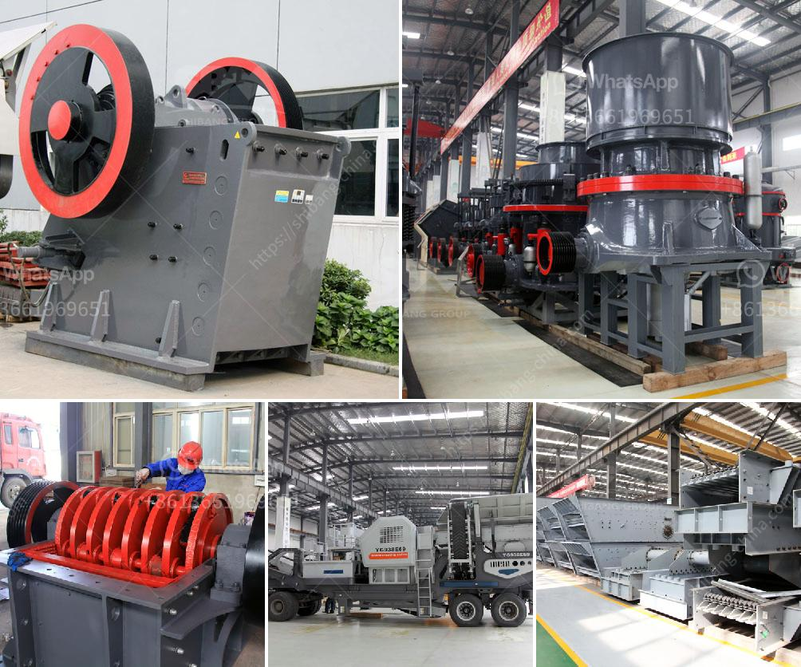

<h3>mkobo crushing and screen</h3>
In the rapidly evolving construction industry, the demand for efficient and sustainable methods is at an all-time high. One company that has taken the lead in revolutionizing construction processes is mkobo Crushing and Screen. With their cutting-edge technology and innovative solutions, they have quickly established themselves as game-changers in the industry.

Mkobo Crushing and Screen is known for its high-performance crushing and screening equipment, which is designed to enhance productivity and streamline construction processes. Their advanced machinery is capable of processing large volumes of material in a fraction of the time compared to traditional methods.

The company's state-of-the-art crushers and screens are equipped with cutting-edge features such as advanced automation, integrated intelligence, and robust durability. These features enable contractors and construction companies to achieve impressive results quickly, saving both time and costs.

Another crucial aspect of mkobo Crushing and Screen's technology is its focus on safety. With increased automation and advanced safety features, their equipment reduces the risks typically associated with manual labor and heavy machinery operation.

For instance, their machines are equipped with intelligent sensors and automated systems that can detect potential hazards and instantly shut down operations. This proactive approach to safety ensures that workers can operate in a risk-free environment, reducing the likelihood of accidents and injuries on construction sites.

As the construction industry faces mounting pressure to embrace sustainable practices, mkobo Crushing and Screen have taken proactive steps to address these concerns. Their equipment is designed with eco-friendly features that minimize energy consumption and reduce environmental impact.

By utilizing advanced technologies for crushing and screening, the company ensures that their machinery operates at optimal efficiency levels, reducing the energy footprint associated with construction processes. Additionally, their equipment is engineered to minimize dust emissions, improving air quality on construction sites and surrounding areas.

Mkobo Crushing and Screen understands that construction projects come in all shapes and sizes, often with varying requirements and materials. Therefore, their technology is designed to be versatile and adaptable, capable of handling an extensive range of materials, including aggregates, concrete, asphalt, and even recycled construction waste.

This adaptability ensures that mkobo Crushing and Screen's equipment can be utilized across multiple construction applications, making them an ideal solution for contractors and construction companies working on diverse projects.

With technology at the forefront of modern construction, mkobo Crushing and Screen stands as a game-changer in the industry. Their cutting-edge crushing and screening equipment provide unmatched efficiency, enhanced safety measures, sustainable solutions, and versatile adaptability.

As the demand for efficient and sustainable construction methods continues to grow, mkobo Crushing and Screen's technology guarantees improved productivity, reduced costs, and a greener approach to building. The company's commitment to innovation ensures that they will remain at the forefront of the ever-evolving construction industry, spearheading positive change and setting new benchmarks for excellence.
<h3>Contact us</h3><ul><li><strong>Whatsapp:&nbsp;<a href="https://wa.me/8613661969651">+8613661969651</a></strong></li><li><a href="https://swt.shibang-china.com/?git&amp;zhl&amp;mkobo crushing and screen"><strong>Online Service(chat now)</strong></a></li></ul><h3>Related</h3><ul><li><a href='impact crusher machine supplier.md'>impact crusher machine supplier</a></li><li><a href='cost of lime stone crusher plant.md'>cost of lime stone crusher plant</a></li><li><a href='used crushing quarry plant in south africa stone.md'>used crushing quarry plant in south africa stone</a></li><li><a href='rock crusher machine price in india.md'>rock crusher machine price in india</a></li><li><a href='250tph comprehensive portable crushing plant.md'>250tph comprehensive portable crushing plant</a></li></ul>