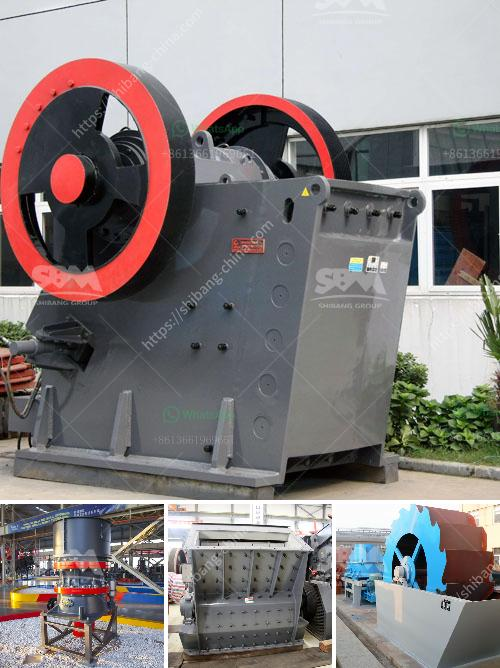

<h3>mobil crusher plant in usa</h3>
The demand for mobile crusher plants is rapidly increasing in the United States. This is due to various factors, including economic growth, infrastructure development, and the rising need for versatile crushing equipment that can be easily transported between job sites. In this article, we will explore the advantages of mobile crusher plants in the USA and how they contribute to the efficiency and productivity of construction projects.

One of the primary advantages of a mobile crusher plant is its ability to be transported to different job sites within a short period. Unlike fixed crushing plants, which require time-consuming disassembly and reassembly, mobile crushers are designed to be easily transported on trailers. This enables construction companies to minimize downtime and quickly move the crushing machinery to where it is needed the most.

Mobile crusher plants in the USA offer a wide range of crushing options for various materials, including hard rocks, ore, and demolition waste. With advanced technology and compact design, these plants maximize productivity while reducing operating costs. Crushers can be equipped with powerful engines and high-capacity hoppers, allowing for efficient processing of materials and better stockpiling capabilities.

Investing in mobile crusher plants proves to be a cost-effective solution, especially for large construction projects. By eliminating the need for multiple crushers and associated equipment, companies can significantly reduce capital costs and operating expenses. The ability to crush and recycle materials on-site also helps save transportation costs, as it eliminates the need to haul them off-site for processing.

Furthermore, mobile crusher plants contribute to sustainability efforts by reducing the environmental impact associated with traditional crushing methods. The ability to crush materials on-site not only reduces the air pollution caused by transportation but also minimizes the need for quarries and reduces the depletion of natural resources.

The utilization of mobile crusher plants in the USA offers numerous advantages for construction companies. With easy transportation, versatile crushing capabilities, cost-effectiveness, and environmental benefits, these plants are revolutionizing the way crushing equipment is used on job sites. As demand continues to grow, it is evident that mobile crusher plants will play a crucial role in meeting the evolving needs of the construction industry in the United States.
<h3>Contact us</h3><ul><li><strong>Whatsapp:&nbsp;<a href="https://wa.me/8613661969651">+8613661969651</a></strong></li><li><a href="https://swt.shibang-china.com/?git&amp;zhl&amp;mobil crusher plant in usa"><strong>Online Service(chat now)</strong></a></li></ul><h3>Related</h3><ul><li><a href='mining plant for sale harare zimbabwe.md'>mining plant for sale harare zimbabwe</a></li><li><a href='portable rock crushers bangalore.md'>portable rock crushers bangalore</a></li><li><a href='used hammer mill crusher.md'>used hammer mill crusher</a></li><li><a href='list of sponge iron factories in hospet.md'>list of sponge iron factories in hospet</a></li><li><a href='crusher machine 200 ton per hours.md'>crusher machine 200 ton per hours</a></li></ul>