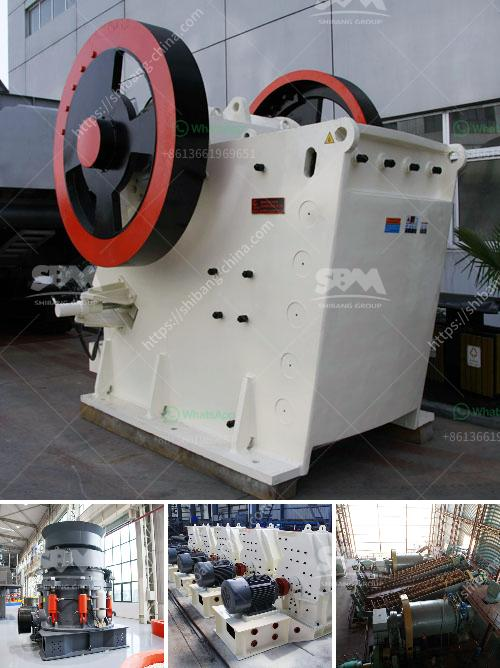

<h3>mobile coal cone crusher provider malaysia</h3>
In today's fast-paced world, technology plays a critical role in driving efficiency and sustainability in various industries, and the mining sector is no exception. As the demand for energy continues to rise, the extraction of coal remains a vital aspect of the global energy mix. However, mining operations face numerous challenges, such as the need for efficient equipment and reducing environmental impact. Addressing these challenges is where mobile coal cone crusher providers, like those in Malaysia, come into play.

A mobile coal cone crusher provider is a specialized piece of machinery used to crush and reduce large coal stones into smaller, more manageable sizes. These powerful devices function by applying mechanical force to break down the coal, generating a uniform product size. The use of such crushers in mining operations helps increase productivity by ensuring a higher proportion of coal is extracted from the earth with minimum waste.

One of the key advantages of mobile coal cone crushers is their portability. Unlike traditional crushers, which are fixed, these mobile units can be easily transported to various mining sites. This flexibility allows mining companies to quickly respond to changing demands and relocate the crusher to areas with higher coal concentrations. Ultimately, this results in increased operational efficiency and cost-effectiveness in coal extraction.

Furthermore, mobile coal cone crusher providers offer a range of advanced features that ensure superior performance and safety. For instance, these crushers are equipped with powerful engines and hydraulic systems, enabling them to handle even the toughest coal materials. They also come with built-in safety mechanisms, such as overload protection and automatic lubrication systems, minimizing the risk of accidents and equipment failures.

Additionally, mobile coal cone crushers contribute to sustainable mining practices. With growing concerns about the environmental impact of coal extraction, the mining industry is under increasing pressure to adopt greener technologies. Mobile coal cone crusher providers address this by reducing emissions and incorporating energy-efficient components. Some models even have advanced dust suppression systems, minimizing airborne pollutants during the crushing process.

It is worth mentioning that mobile coal cone crusher providers in Malaysia have gained significant recognition in the international market. Malaysian manufacturers are known for their expertise in designing and fabricating high-quality crushers that deliver exceptional performance and durability. These robust machines are capable of withstanding harsh operating conditions prevalent in the mining sector, ensuring long service life with minimal downtime.

In conclusion, mobile coal cone crusher providers in Malaysia offer a powerful and sustainable solution for the mining industry. Their portability, advanced features, and commitment to sustainability make them an indispensable tool in efficiently extracting coal while minimizing environmental impact. These devices enable mining companies to meet the growing energy demand while adhering to strict regulations and promoting responsible mining practices. As the mining sector evolves, the demand for mobile coal cone crushers will likely continue to grow, and Malaysia is well-positioned to provide top-quality equipment to meet this demand.
<h3>Contact us</h3><ul><li><strong>Whatsapp:&nbsp;<a href="https://wa.me/8613661969651">+8613661969651</a></strong></li><li><a href="https://swt.shibang-china.com/?git&amp;zhl&amp;mobile coal cone crusher provider malaysia"><strong>Online Service(chat now)</strong></a></li></ul><h3>Related</h3><ul><li><a href='granite quarrying and processing firm in kaduna.md'>granite quarrying and processing firm in kaduna</a></li><li><a href='iron washer making machine with price in india.md'>iron washer making machine with price in india</a></li><li><a href='slag crusher machine project products.md'>slag crusher machine project products</a></li><li><a href='gold refinery in philippines south africa.md'>gold refinery in philippines south africa</a></li><li><a href='estimate cost simple stone crusher plant.md'>estimate cost simple stone crusher plant</a></li></ul>