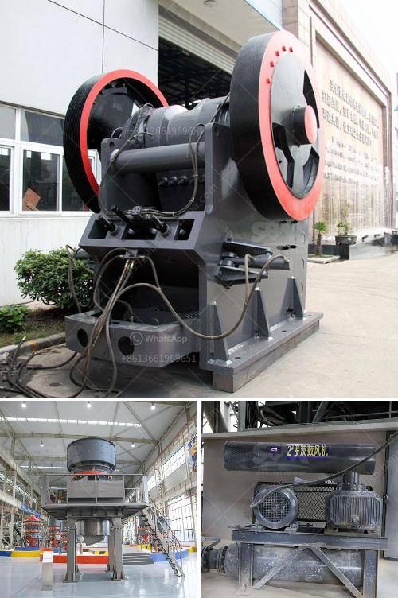

<h3>mobile copper concentrate machine</h3>
The mining industry plays a crucial role in the global economy, contributing to the production of essential metals and minerals used in various sectors. Mining companies constantly strive to optimize their operations and improve efficiency. In this pursuit, mobile copper concentrate machines have emerged as a game-changer, revolutionizing the way copper concentrate is extracted, processed, and transported.

Traditionally, copper concentrate production involved hauling large quantities of ore from the mining site to a centralized processing plant. This process was not only time-consuming but also expensive, as it necessitated the use of heavy machinery and extensive transportation networks. Furthermore, this centralized approach created additional logistical challenges, such as the need for storage facilities and the risk of inventory losses or pilferages.

However, with advancements in technology, the introduction of mobile copper concentrate machines has transformed the mining landscape. These innovative machines are designed to be mobile, modular, and self-contained, enabling on-site processing of copper concentrate. Their compact size and ease of setup allow mining companies to process the copper concentrate at or near the mining site, significantly reducing transportation costs and associated environmental impacts.

Mobile copper concentrate machines offer several advantages over traditional processing methods. Firstly, they eliminate the need for large-scale transportation infrastructure, reducing the carbon footprint and energy consumption associated with long-distance hauling. This not only helps mining companies achieve their sustainability goals but also minimizes the impact on local communities and ecosystems.

Moreover, mobile copper concentrate machines enable real-time monitoring and control of the processing operations. Equipped with advanced sensors and automation technology, these machines can maintain optimal processing conditions, resulting in higher extraction efficiencies and improved product quality. The ability to fine-tune the processing parameters maximizes the recovery of valuable copper and minimizes waste, thereby increasing profitability for mining companies.

Additionally, mobile copper concentrate machines provide flexibility and agility to mining operations. They can be easily transported to different mining sites, allowing companies to exploit new deposits without investing in additional infrastructure. This minimizes the risks associated with long-term capital investments, giving mining companies the agility to adapt to changing market conditions and economic uncertainties.

Furthermore, the modular design of mobile copper concentrate machines enables scalability. Mining companies can add or remove processing units based on the ore grade and production volume, optimizing the use of resources and capital. This capability to scale production up or down ensures operational efficiency and cost-effectiveness, making mobile copper concentrate machines a valuable asset for mining companies of all sizes.

In conclusion, mobile copper concentrate machines have proven to be a game-changer in the mining industry. With their ability to process copper concentrate on-site, these machines slash transportation costs, improve operational efficiency, and minimize environmental impacts. The real-time monitoring and control features, along with the flexibility and scalability, make them an attractive investment for mining companies aiming to enhance their competitiveness in the global market. As the mining industry continues to evolve, mobile copper concentrate machines are poised to become an integral part of the mining operations, revolutionizing the way copper concentrate is extracted, processed, and transported.
<h3>Contact us</h3><ul><li><strong>Whatsapp:&nbsp;<a href="https://wa.me/8613661969651">+8613661969651</a></strong></li><li><a href="https://swt.shibang-china.com/?git&amp;zhl&amp;mobile copper concentrate machine"><strong>Online Service(chat now)</strong></a></li></ul><h3>Related</h3><ul><li><a href='cement plant in brazil.md'>cement plant in brazil</a></li><li><a href='mining mobile crusher and washing lebanon.md'>mining mobile crusher and washing lebanon</a></li><li><a href='list iron ore pellet plants in india.md'>list iron ore pellet plants in india</a></li><li><a href='used mobile jaw crusher for sale uk.md'>used mobile jaw crusher for sale uk</a></li><li><a href='vibrating screen for fine sand.md'>vibrating screen for fine sand</a></li></ul>