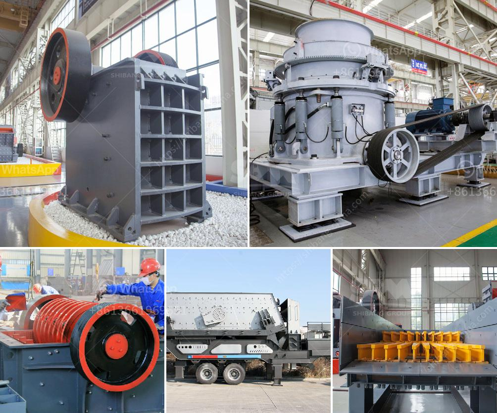

<h3>mobile crawler crusher price</h3>
Mobile crawler crusher, also known as tracked crusher, crawler crusher, or simply mobile crusher, is an indispensable machine for various stone crushing requirements. It is widely used in mining, quarrying, cement, highway and other industries. With the increasing demands for mobile crushers, the market is flooded with various brands and models, which has made purchasing decisions difficult for customers. In this article, we will discuss the price of mobile crawler crusher in detail.

The price of a mobile crawler crusher is influenced by many factors. The first and foremost factor is the type of crusher. Generally, there are two types of mobile crushers – crawler type and tire type. Crawler crushers consist of crawler chassis, engine, and feeding and crushing units, while tire crushers include cone, jaw, and impact crushers. Each type has its own advantages and is suitable for different applications. Therefore, the price of these crushers may vary accordingly.

Another important factor that affects the price is the production capacity. Mobile crawler crushers are available in different capacities ranging from 50tph to 500tph. The higher the capacity, the higher the price. This is because crushers with higher capacity are generally equipped with more advanced technology and stronger components to ensure efficient and reliable operation.

Apart from the type and capacity, the price is also influenced by the brand and model of the crusher. Well-known brands with a good reputation tend to have higher prices due to their superior quality and after-sales service. In contrast, lesser-known brands may offer lower prices to attract customers, but the quality and reliability might be compromised. Therefore, it is crucial for buyers to consider their budget, requirements, and brand preferences when making a purchase decision.

In addition to the basic price of the crusher, there are also additional costs that need to be taken into account. These include transportation costs, installation and commissioning fees, and maintenance and repair expenses. Some sellers may offer these services as part of the purchase package, while others may charge extra. Buyers should carefully compare the overall costs and services offered by different sellers to make an informed decision.

It is worth mentioning that the price of a mobile crawler crusher can also vary from country to country. Factors such as import duties, taxes, and local market conditions can impact the final price. Therefore, buyers should consider purchasing from local distributors or dealers to minimize costs and ensure better after-sales service.

In conclusion, the price of a mobile crawler crusher is determined by various factors including type, capacity, brand, model, and additional costs. Buyers should carefully evaluate their requirements, budget, and available options before making a purchase decision. Comparing prices and services offered by different sellers is essential to get the best value for money. Ultimately, investing in a high-quality mobile crawler crusher is crucial for efficient stone crushing operations and long-term profitability.
<h3>Contact us</h3><ul><li><strong>Whatsapp:&nbsp;<a href="https://wa.me/8613661969651">+8613661969651</a></strong></li><li><a href="https://swt.shibang-china.com/?git&amp;zhl&amp;mobile crawler crusher price"><strong>Online Service(chat now)</strong></a></li></ul><h3>Related</h3><ul><li><a href='impact crusher 5tph for sale south africa.md'>impact crusher 5tph for sale south africa</a></li><li><a href='quarry machines for sale.md'>quarry machines for sale</a></li><li><a href='stone crusher plant in punjab.md'>stone crusher plant in punjab</a></li><li><a href='mkobo crushing and screen.md'>mkobo crushing and screen</a></li><li><a href='stone quarry crusher companies in ghana.md'>stone quarry crusher companies in ghana</a></li></ul>