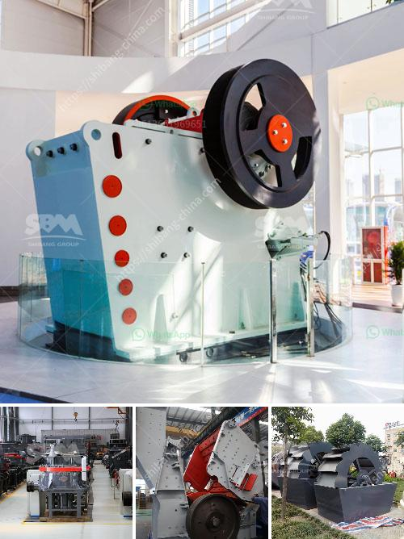

<h3>mobile crusher alkatrate</h3>
In recent years, the demand for crushed stones and aggregates has rapidly increased due to the growth in the construction industry. To cater to this demand, there has been a constant evolution in crushing technology to ensure efficient and cost-effective production. One such innovation that has revolutionized the crushing industry is the mobile crusher, specifically the mobile crusher alkatrate.

The mobile crusher alkatrate is a state-of-the-art machine that is designed to efficiently process various types of materials, including rocks, ores, and demolition waste. It is equipped with advanced features and technologies that allow for easy and quick crushing of these materials.

One of the key advantages of the mobile crusher alkatrate is its portability. Unlike traditional stationary crushers, this mobile crusher can be easily moved from one location to another, allowing for flexibility and convenience. Whether it is a construction site or a quarry, the mobile crusher alkatrate can be quickly set up and ready to operate.

Furthermore, the mobile crusher alkatrate is equipped with a powerful engine that provides high crushing efficiency. It can crush large volumes of materials in a short period, reducing the time and labor required for crushing operations. This not only increases productivity but also reduces costs associated with labor and maintenance.

Another notable feature of the mobile crusher alkatrate is its environmentally-friendly nature. It is designed to minimize dust emissions and noise pollution, ensuring a clean and peaceful working environment. Additionally, it operates on a fuel-efficient engine, reducing fuel consumption and carbon footprint.

The mobile crusher alkatrate also comes with advanced control systems that enhance its performance and safety. These systems allow for precise adjustment of the crusher settings, ensuring optimal crushing results. Moreover, they include safety features such as automatic shutdown in case of any abnormalities, protecting both the machine and operators.

In conclusion, the mobile crusher alkatrate has drastically changed the crushing industry by providing a portable, efficient, and environmentally-friendly solution. It offers numerous advantages, including ease of transport, high crushing efficiency, and advanced control systems. As the demand for crushed stones and aggregates continues to grow, the mobile crusher alkatrate stands at the forefront of crushing technology, revolutionizing the way materials are processed.
<h3>Contact us</h3><ul><li><strong>Whatsapp:&nbsp;<a href="https://wa.me/8613661969651">+8613661969651</a></strong></li><li><a href="https://swt.shibang-china.com/?git&amp;zhl&amp;mobile crusher alkatrate"><strong>Online Service(chat now)</strong></a></li></ul><h3>Related</h3><ul><li><a href='stone crusher machine price in ethiopia.md'>stone crusher machine price in ethiopia</a></li><li><a href='cone crusher manufacturers for sale in italy.md'>cone crusher manufacturers for sale in italy</a></li><li><a href='technical specification limestone milling system.md'>technical specification limestone milling system</a></li><li><a href='silica sand grinding machine.md'>silica sand grinding machine</a></li><li><a href='density of 2mm 1mm aggregate and river crusher sand.md'>density of 2mm 1mm aggregate and river crusher sand</a></li></ul>