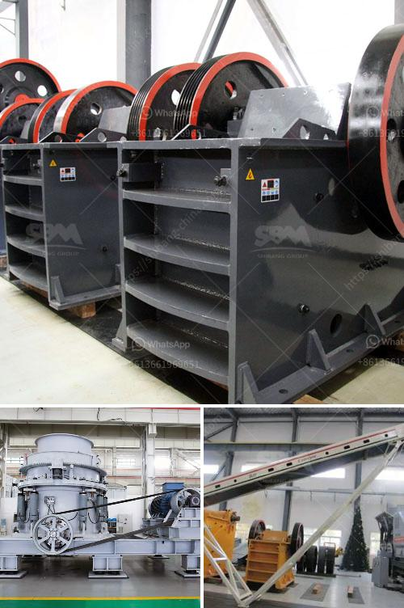

<h3>mobile crusher china</h3>
Mobile crusher, also known as the mobile crushing plant, is a versatile and efficient crushing equipment that can be used for a wide range of industries. As the name suggests, it can eliminate the need for transportation and greatly reduce the transportation costs for materials. In addition, the mobile crusher allows the operation to be performed directly on-site, which offers great convenience and flexibility for project execution.

China, being one of the largest producers of mobile crushers in the world, has been offering a wide variety of crushers to fulfill different customer needs. Equipped with advanced technology and a strong manufacturing infrastructure, Chinese mobile crushers have gained popularity for their high efficiency, durability, and reliability.

One of the key advantages of mobile crushers from China is the ability to move easily. They are designed to be compact and lightweight, enabling quick and easy transportation from one site to another. Whether it is a construction site, mining operation, or quarry, the mobile crusher can be easily moved to the desired location, minimizing downtime and maximizing productivity.

Another notable feature of Chinese mobile crushers is their energy efficiency. These crushers are equipped with advanced power management systems and are designed to consume less energy during operation. This not only helps in reducing operational costs but also contributes to a greener environment.

Furthermore, mobile crushers from China are known for their excellent performance and outstanding crushing capacity. They are designed to handle a wide range of materials, from soft to hard rocks, and can produce high-quality aggregates for various applications. With their powerful engines and robust construction, these crushers can handle heavy-duty tasks and deliver consistent results.

In conclusion, mobile crushers from China are a reliable and cost-effective solution for material crushing and processing. Their mobility, energy efficiency, and excellent performance make them a preferred choice for many industries. Whether it is a construction project, mining operation, or quarry, the mobile crusher from China can effectively meet the crushing needs of any site.
<h3>Contact us</h3><ul><li><strong>Whatsapp:&nbsp;<a href="https://wa.me/8613661969651">+8613661969651</a></strong></li><li><a href="https://swt.shibang-china.com/?git&amp;zhl&amp;mobile crusher china"><strong>Online Service(chat now)</strong></a></li></ul><h3>Related</h3><ul><li><a href='mineral grinding raymond.md'>mineral grinding raymond</a></li><li><a href='are vertical ultrafine mill roller.md'>are vertical ultrafine mill roller</a></li><li><a href='mobile fine jaw crusher at saudi arabia.md'>mobile fine jaw crusher at saudi arabia</a></li><li><a href='puzzolana 200 tph cone crusher plant price.md'>puzzolana 200 tph cone crusher plant price</a></li><li><a href='stone crusher machine pakistan.md'>stone crusher machine pakistan</a></li></ul>