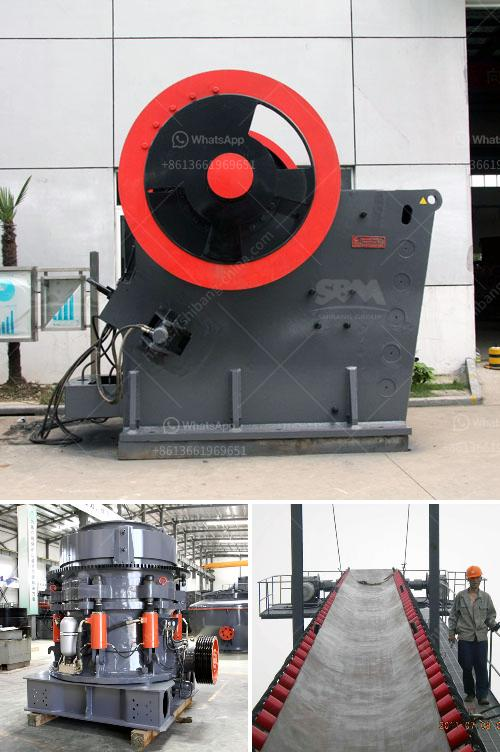

<h3>mobile crusher datasheet</h3>
Mobile crushers are essential machinery in the construction and mining industries. They enable efficient and cost-effective crushing of various materials, including concrete, rocks, and aggregates. One crucial aspect of mobile crushers is their datasheet, which provides detailed information about their specifications, capabilities, and performance.

A mobile crusher datasheet typically includes technical details like weight, dimensions, power requirements, crushing capacity, maximum feed size, and operating speed. This information helps contractors and operators choose the right machine for their specific needs. For instance, if a project requires crushing large rocks, then a crusher with a higher crushing capacity and larger maximum feed size would be preferred. On the other hand, if the project involves crushing concrete, a crusher with a lower crushing capacity may be sufficient.

Moreover, the datasheet also provides details about the crushing mechanisms, such as jaw crushers, impact crushers, or cone crushers. Each mechanism has its advantages and is suitable for different materials. For example, jaw crushers are ideal for primary crushing of hard materials, while cone crushers are more suitable for secondary or tertiary crushing.

Additionally, the datasheet may include information about the crusher's mobility features. Many mobile crushers are equipped with tracks or wheels, allowing easy transportation on various terrains. This feature is particularly beneficial for projects that require moving the crusher from one location to another frequently.

Safety features and maintenance requirements can also be found on the datasheet. Mobile crushers should comply with safety standards and provide necessary safeguards to protect operators. Furthermore, the datasheet may highlight servicing and maintenance intervals, helping operators plan and optimize the crusher's performance and lifespan.

In conclusion, mobile crusher datasheets play a significant role in the selection and use of these machines. They provide valuable information about technical specifications, crushing capabilities, mobility features, safety requirements, and maintenance needs. By referring to these datasheets, construction and mining professionals can make informed decisions, ensuring effective and reliable crushing operations.
<h3>Contact us</h3><ul><li><strong>Whatsapp:&nbsp;<a href="https://wa.me/8613661969651">+8613661969651</a></strong></li><li><a href="https://swt.shibang-china.com/?git&amp;zhl&amp;mobile crusher datasheet"><strong>Online Service(chat now)</strong></a></li></ul><h3>Related</h3><ul><li><a href='portable gold rock crushing machine.md'>portable gold rock crushing machine</a></li><li><a href='ball mill supplier in malaysia pakistan.md'>ball mill supplier in malaysia pakistan</a></li><li><a href='mobile stone crusher suppliers.md'>mobile stone crusher suppliers</a></li><li><a href='dry process of cement.md'>dry process of cement</a></li><li><a href='mobile crushers saudi.md'>mobile crushers saudi</a></li></ul>