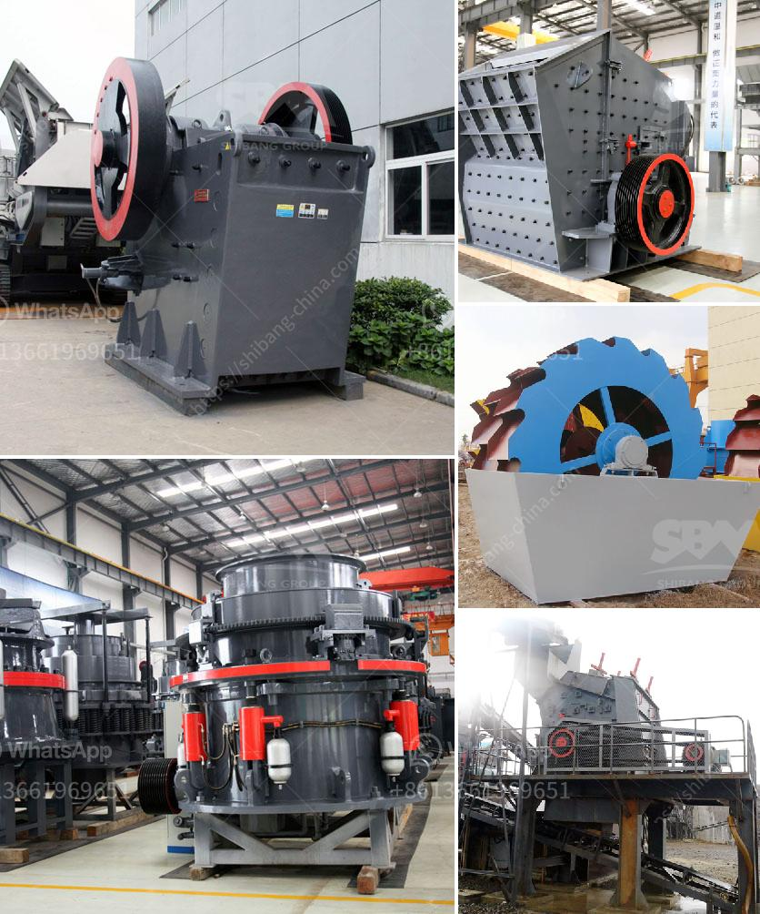

<h3>mobile crusher in codelco</h3>
Mining operations are inherently challenging, considering the varied nature of and logistical concerns associated with extracting valuable materials from the earth. Traditional methods of mining often entail complex processes, large machinery, and significant investments. However, with the advent of advanced technologies, mining companies are increasingly adopting innovative solutions to streamline their operations and improve efficiency. One such technology that has revolutionized mining operations is the mobile crusher, as employed by Codelco, the world's largest copper producer.

Mobile crushers are compact, self-contained machines that feature advanced crushing technology, which enables them to handle even the toughest of materials. These crushers are versatile and can be operated in a wide variety of applications, including mining, quarrying, demolition, and recycling. The mobility feature ensures that operations are not limited by geographic constraints, enabling mining companies to extract valuable minerals from remote locations.

Codelco recognized the immense potential of mobile crushers in optimizing their mining operations. The harsh, mountainous terrain in which their mines are located posed significant logistical challenges, especially when it came to transporting the extracted copper ore to processing plants. Conventional methods involved the use of large trucks to transport the ore over long distances, resulting in high fuel consumption and increased operational costs. The mobile crusher has effectively addressed these challenges by eliminating the need for transportation and facilitating on-site processing.

Codelco has strategically placed mobile crushers in close proximity to their mining sites, allowing for immediate crushing and processing of the extracted copper ore. The crushers are equipped with powerful jaw or impact crushers that reduce the size of the ore particles, facilitating efficient processing. Additionally, the mobile crushers can be easily moved from one site to another, based on the mining schedule and ore availability, ensuring continuity of operations.

The utilization of mobile crushers has significantly improved Codelco's operational efficiency. Not only does it eliminate the need for transportation, but it also reduces the time required to process the ore. This has resulted in increased productivity and cost savings for the company. The crushers' compact size also minimizes the environmental footprint associated with mining operations, as it reduces the amount of waste generated and the noise and dust emissions typically associated with traditional mining processes.

Furthermore, mobile crushers have also enhanced worker safety at Codelco's mining sites. The ability to process the ore on-site eliminates the need for manual handling and loading of heavy trucks, reducing the risk of accidents and injuries. Additionally, the advanced technology incorporated in these crushers ensures smooth and controlled crushing, minimizing the potential for equipment failures or breakdowns, further enhancing worker safety.

In conclusion, mobile crushers have revolutionized mining operations, as exemplified by their successful implementation at Codelco. These versatile machines have not only improved operational efficiency but have also enhanced worker safety and minimized environmental impacts. As technology continues to advance, the mining industry can expect further innovations and improvements in mobile crusher capabilities, making it an essential tool for any mining operation in the future.
<h3>Contact us</h3><ul><li><strong>Whatsapp:&nbsp;<a href="https://wa.me/8613661969651">+8613661969651</a></strong></li><li><a href="https://swt.shibang-china.com/?git&amp;zhl&amp;mobile crusher in codelco"><strong>Online Service(chat now)</strong></a></li></ul><h3>Related</h3><ul><li><a href='how to make marble powder statues.md'>how to make marble powder statues</a></li><li><a href='jaw crusher process description.md'>jaw crusher process description</a></li><li><a href='china granite crusher.md'>china granite crusher</a></li><li><a href='control plan for ball mill manufacturing.md'>control plan for ball mill manufacturing</a></li><li><a href='ball mill capacity how to calculate.md'>ball mill capacity how to calculate</a></li></ul>