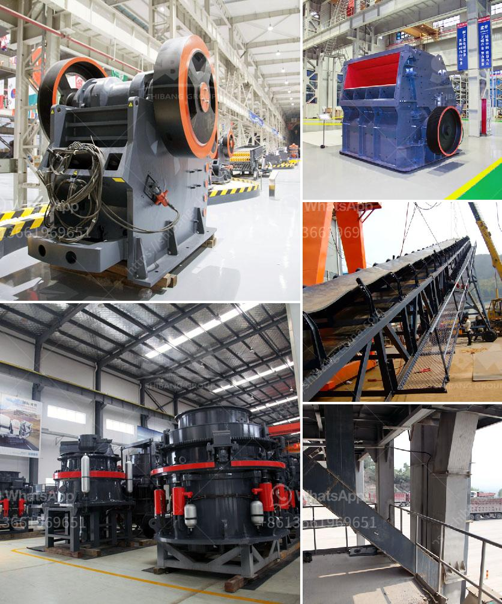

<h3>mobile crusher morocco price</h3>
The mobile crusher market is booming in Morocco, and it's not hard to see why. With the country's rapidly growing construction and mining industries, there is a great demand for quality equipment specifically designed to meet these requirements. One such machine that has proven to be highly effective in meeting these demands is the mobile crusher.

A mobile crusher is a machine designed to reduce large rocks into smaller rocks, gravel, or sand. It can be used to crush materials such as limestone, granite, and concrete. What sets this machine apart from traditional crushers is the ability to move it from one site to another with ease. This mobility allows for greater flexibility and efficiency in the workplace.

Price is always a crucial factor when considering any purchase, and in the case of a mobile crusher, it's no different. The price of a mobile crusher in Morocco can vary depending on several factors, such as the type of machine, the capacity, and the features it offers. On average, the price of a mobile crusher ranges from around $70,000 to $850,000.

The most basic mobile crusher models are generally the least expensive, but they still offer effective crushing capabilities. These models are usually smaller and have a lower capacity, making them suitable for small to medium-sized projects. As the size and capacity of the machine increase, so does the price.

In addition to size and capacity, the features and options available with a mobile crusher can also impact the price. For example, advanced models may offer features such as advanced control systems, wireless remote control, and hydraulic adjustment. While these features can significantly enhance the performance and convenience of the machine, they also come at an additional cost.

It's important to note that the price of a mobile crusher is not the only factor to consider when making a purchase. The reputation and reliability of the manufacturer, as well as the quality of their equipment, should also be taken into account. Companies with a proven track record of producing durable and reliable machines are generally a safer bet, even if their prices may be slightly higher.

In conclusion, the price of a mobile crusher in Morocco can vary depending on several factors, including the type, capacity, and features of the machine. While price is an important consideration, it shouldn't be the only factor when making a purchase. The reputation and reliability of the manufacturer, as well as the quality of the equipment, should also be taken into account. Overall, a mobile crusher is an invaluable tool in Morocco's construction and mining industries, and the investment in a quality machine is well worth it in the long run.
<h3>Contact us</h3><ul><li><strong>Whatsapp:&nbsp;<a href="https://wa.me/8613661969651">+8613661969651</a></strong></li><li><a href="https://swt.shibang-china.com/?git&amp;zhl&amp;mobile crusher morocco price"><strong>Online Service(chat now)</strong></a></li></ul><h3>Related</h3><ul><li><a href='price of jaw crusher.md'>price of jaw crusher</a></li><li><a href='nigeria stone grinder mill.md'>nigeria stone grinder mill</a></li><li><a href='gypsum production process plant design.md'>gypsum production process plant design</a></li><li><a href='stone crusher in philippines.md'>stone crusher in philippines</a></li><li><a href='jual raymond mill bekas.md'>jual raymond mill bekas</a></li></ul>