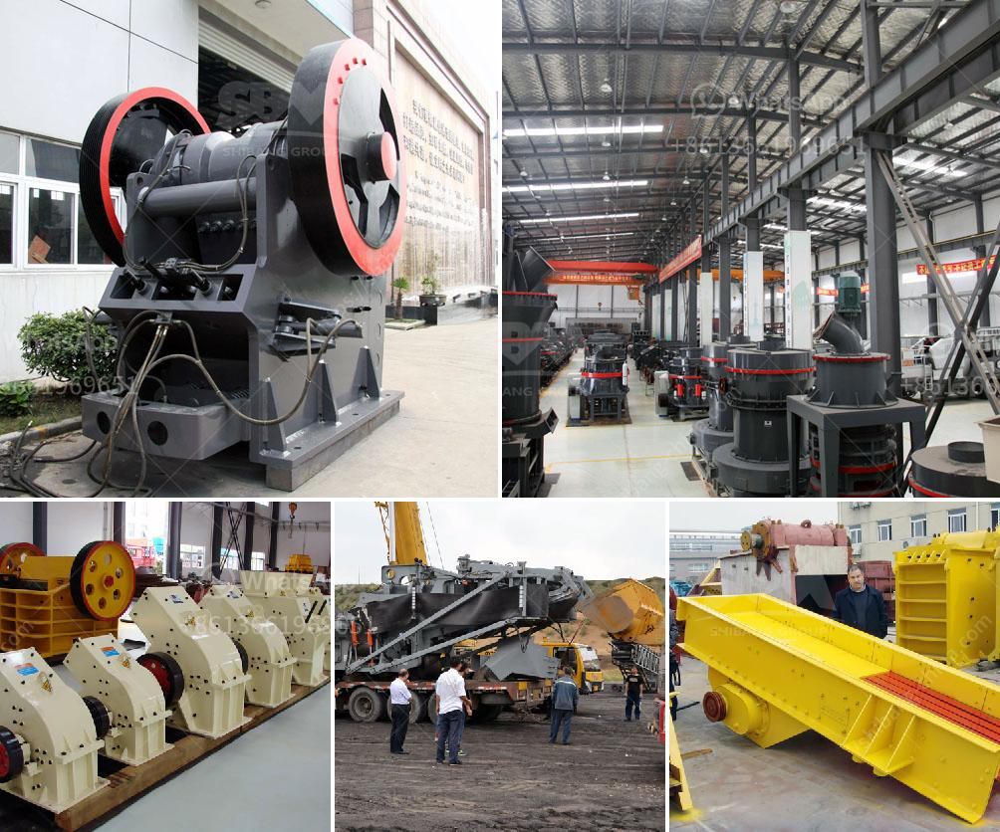

<h3>mobile crusher plant prices</h3>
Mobile crusher plant prices are always important factors for customers in choosing crushing equipment. With the booming development of mining and construction industry, there are increasing demands for stone crushers and mines. The prices of mobile crusher plants made by Heavy Industry, a leading manufacturer of crushing and screening equipment, are more affordable for many customers.

With the rapid development of crushing and screening industry, more and more customers choose to purchase mobile crushing plants for construction waste recycling projects, mining projects, and quarrying operations. The mobile crusher plant prices are different according to the different crushing equipment used in mobile crusher plants. This article will introduce several factors for customers to choose mobile crusher plant prices.

First, customers should consider the type of mobile crusher plant. There are two main types of mobile crushing plants: crawler-type mobile crushing plant and wheel-type mobile crushing plant. Crawler-type mobile crushing plant has advanced technology, excellent performance and high production efficiency, while wheel-type mobile crushing plant is easy to operate and move. The prices of these two types of mobile crusher plants are also different.

Second, the capacity of mobile crusher plant. Mobile crusher plant prices are closely related to the production capacity of the equipment. The larger the production capacity, the higher the equipment price. In contrast, the smaller the production capacity, the lower the equipment price. Different mobile crusher plants have different production capacities, ranging from 50-500 tons/hour. Customers should choose a suitable mobile crusher plant according to their own needs and budget.

Third, the brand reputation of mobile crusher plant manufacturers. Brand reputation is an important factor for customers to consider when purchasing mobile crusher plants. A well-known brand usually represents high-quality products and excellent after-sales service. Heavy Industry is a reputable manufacturer with more than 30 years of experience in crushing equipment production. The mobile crusher plants produced by Heavy Industry have been widely recognized and praised by customers at home and abroad.

Fourth, the quality of mobile crusher plant. Good quality mobile crusher plants have longer service life, higher production efficiency, and lower maintenance costs. Customers should choose mobile crusher plants with high-quality materials and advanced technology to ensure the stable and efficient operation of the equipment.

In conclusion, when choosing mobile crusher plant prices, customers should consider the type of mobile crusher plant, the capacity of the equipment, the brand reputation of manufacturers, and the quality of the equipment. Heavy Industry provides a wide range of mobile crusher plants with competitive prices and excellent quality. If you want to know more about mobile crusher plant prices, please contact us and we will provide you with professional and detailed information.
<h3>Contact us</h3><ul><li><strong>Whatsapp:&nbsp;<a href="https://wa.me/8613661969651">+8613661969651</a></strong></li><li><a href="https://swt.shibang-china.com/?git&amp;zhl&amp;mobile crusher plant prices"><strong>Online Service(chat now)</strong></a></li></ul><h3>Related</h3><ul><li><a href='50 tpd cement plant cost in india.md'>50 tpd cement plant cost in india</a></li><li><a href='made in germany stone crusher.md'>made in germany stone crusher</a></li><li><a href='slag processing plant.md'>slag processing plant</a></li><li><a href='price of stone crush machine in pakistan.md'>price of stone crush machine in pakistan</a></li><li><a href='bentonite processing.md'>bentonite processing</a></li></ul>