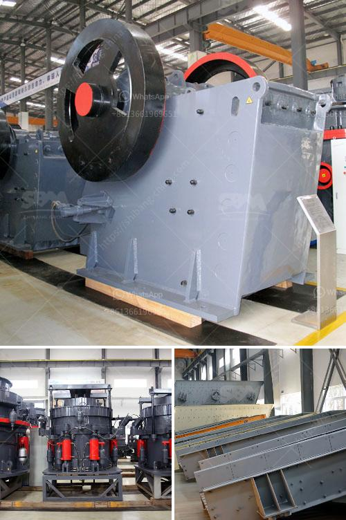

<h3>mobile crusher tanzania</h3>
Mobile crushers are gaining in popularity for recycling demolition material on site for hardcore. But this is not a new idea, there were mobile crushers back in the steam days and several examples can be seen at shows in the demonstration areas, with several having demonstrations of road making the old way, complete with all the period kit.

Modern mobile crushing equipment allows operators to move freely on site, with the highest efficiency. Mobile crusher has been the workhorse for 20 years. When most crushers are too big and others are too small the RM 90GO! is just right.

The RM 90GO! weighs just 65,000 lbs. The rugged construction of the RM machines guarantees durability in challenging conditions, which means a long service life. This means that the mobile crusher can maximize your profitability. Appropriately designed in terms of simplicity and functionality, this machine exceeds the expectations of operators.

The RM 90GO! provides multiple benefits for contractors and construction companies looking to improve their operational efficiency and increase profits. The flexibility of this mobile crusher allows it to work in any demanding environment.

Mobile crushers can reduce rock, concrete, and other debris to the size of gravel, and they can maneuver themselves around a work site—but not at the same time. That’s how these dual-purpose machines can get away with having a single hydraulic power unit. Alan Holtham explains further.

Mobile crushers and screeners can replace stationary crushing systems, which reduces the need for hauling and thus cuts operational costs. With mobile crushers, fewer haulage trucks are needed to transport the material, effectively lowering the operational expenses. Moreover, the utilization of mobile crushers facilitates the processing of materials on site, reducing the environmental impact of the entire process.

Tanzania relies heavily on mining activities for its revenue. During the XXI century, Africa experienced a mining boom, leading to several large-scale mining projects opening in the country. Today, Tanzania is the fourth largest gold producer in Africa, and about 10 percent of its gold comes from small-scale miners. The mining sector contributes approximately 3.5 percent to the country's GDP.

Tanzania has an abundant amount of minerals and gemstones, making it an attractive hub for mining activities. The lure of quick wealth through mining has resulted in a surge in the number of small-scale miners, often working informally, with poor mining practices. These miners frequently use rudimentary equipment and lack access to adequate machinery capable of processing the extracted minerals efficiently.

Mobile crushers have been widely used in Tanzania since their introduction in the early 2000s. However, the majority of small-scale miners appreciated their ability to process relatively low quantities of ore at high speed, thus providing a feasible option for economically viable mining operations.

Tanzania has embarked on various initiatives aimed at formalizing the artisanal and small-scale mining sector, enhancing the integration of these miners into the formal economy, and guaranteeing their safety. Mobile crushers play a key role in this effort, allowing miners to crush and process minerals on-site, which significantly reduces the environmental impact of the entire mining process.

In conclusion, mobile crushers provide an efficient method of processing minerals and materials on-site, minimizing the need for transporti
<h3>Contact us</h3><ul><li><strong>Whatsapp:&nbsp;<a href="https://wa.me/8613661969651">+8613661969651</a></strong></li><li><a href="https://swt.shibang-china.com/?git&amp;zhl&amp;mobile crusher tanzania"><strong>Online Service(chat now)</strong></a></li></ul><h3>Related</h3><ul><li><a href='mobile mining gold equipment.md'>mobile mining gold equipment</a></li><li><a href='hot sale and low cost mobile crushing plant.md'>hot sale and low cost mobile crushing plant</a></li><li><a href='price list of used stone crushers in kenya.md'>price list of used stone crushers in kenya</a></li><li><a href='gold mining machine from germany.md'>gold mining machine from germany</a></li><li><a href='gold refining equipment toronto.md'>gold refining equipment toronto</a></li></ul>