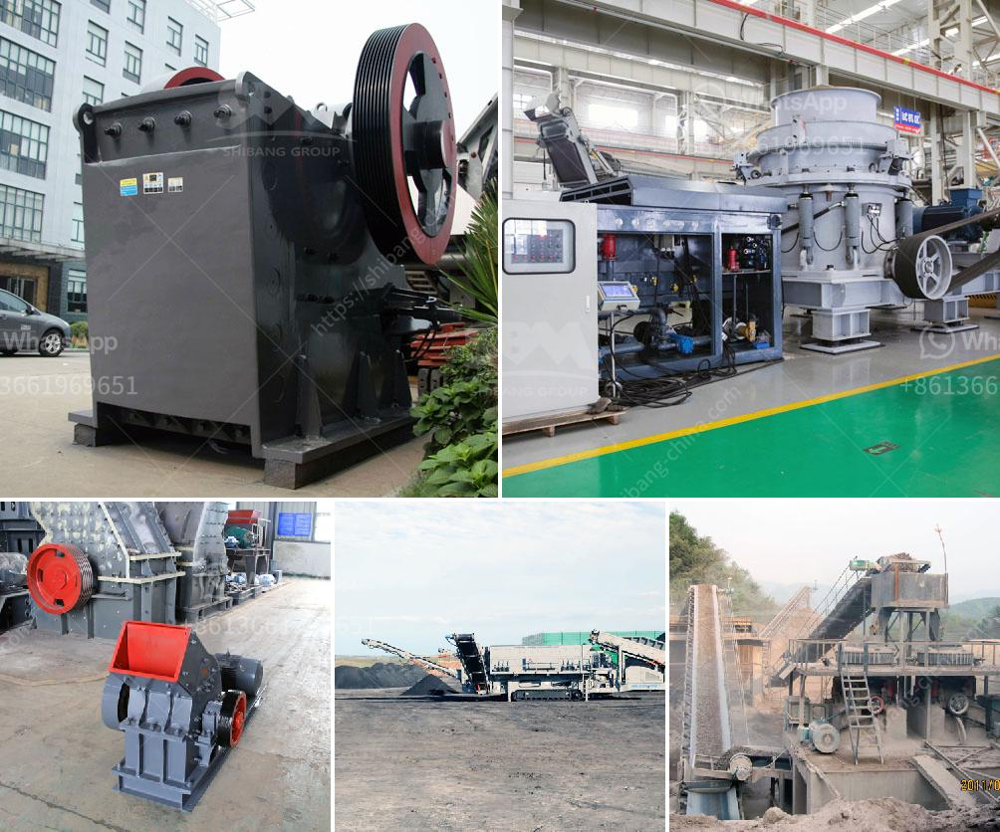

<h3>mobile crushers and screens</h3>
Mobile crushers and screens have revolutionized the mining and construction industry by providing the ability to move materials from one location to another efficiently. With the advent of these machines, it is now possible to process various types of materials, such as ores, rocks, and concrete, at any job site.

One of the primary advantages of mobile crushers and screens is their flexibility. They can be easily transported to different locations, allowing operators to quickly set up and dismantle them. This versatility is especially beneficial for projects that require frequent relocation or involve multiple job sites.

In addition to mobility, mobile crushers and screens offer high levels of productivity. These machines are equipped with advanced features, such as powerful engines, efficient crushing mechanisms, and high-capacity screens. They are designed to handle large volumes of material, making them ideal for large-scale mining operations or construction projects.

Furthermore, mobile crushers and screens are designed to be user-friendly. Operators can easily control various functions, such as the speed of the conveyor belt or the size of the crushed material, through an intuitive interface. This ease of use not only increases productivity but also reduces the risk of operator errors.

Additionally, mobile crushers and screens are built to withstand harsh working conditions. They are constructed with robust materials and innovative engineering to ensure durability and longevity. These machines can withstand extreme temperatures, vibrations, and impacts, making them reliable and cost-effective in the long run.

Lastly, mobile crushers and screens offer environmental benefits. They are equipped with advanced dust suppression systems, reducing the amount of dust and particles released into the air during the crushing process. This feature enhances the working environment and promotes a healthier atmosphere for both operators and nearby communities.

In conclusion, mobile crushers and screens have revolutionized the mining and construction industry with their mobility, high productivity, user-friendly interface, durability, and environmental benefits. These machines have become essential tools for various projects, providing efficiency and convenience to operators around the world.
<h3>Contact us</h3><ul><li><strong>Whatsapp:&nbsp;<a href="https://wa.me/8613661969651">+8613661969651</a></strong></li><li><a href="https://swt.shibang-china.com/?git&amp;zhl&amp;mobile crushers and screens"><strong>Online Service(chat now)</strong></a></li></ul><h3>Related</h3><ul><li><a href='list of sponge iron factories in hospet.md'>list of sponge iron factories in hospet</a></li><li><a href='how much would it cost to start a gravel quarry.md'>how much would it cost to start a gravel quarry</a></li><li><a href='specification for pe 250x400 jaw crusher.md'>specification for pe 250x400 jaw crusher</a></li><li><a href='rock crusher for sale philippines.md'>rock crusher for sale philippines</a></li><li><a href='marble grinding mills machine.md'>marble grinding mills machine</a></li></ul>