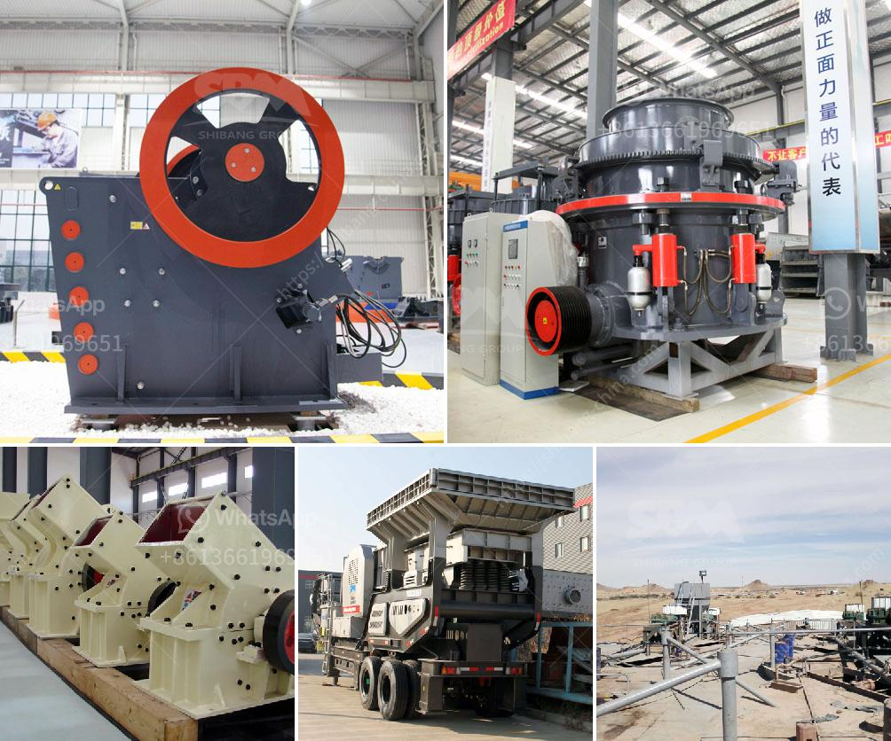

<h3>mobile crushers hire south africa</h3>
Mobile crushers are track-mounted rock crushing machines that are easily movable on and between production sites. They are widely used in aggregates production, recycling applications, and in mining operations. Mobile crushers can replace stationary crushing systems, which reduces the need for hauling and thus cuts operational costs.

With mobile crushers, it’s also possible to crush multiple materials at the same time, making them highly efficient. The mobility factor enables these machines to move to different locations within a short period and set up easily. This flexibility and ease of operation make mobile crushers an ideal choice for contractors, quarry operators, and other businesses in South Africa.

When it comes to mobile crushers hire South Africa, many companies prefer a rental rather than purchasing the equipment. This is primarily due to the cost-effectiveness of renting versus owning. Equipment rental is a relatively low-risk investment that allows businesses to free up capital and allocate resources efficiently.

Hiring a mobile crusher in South Africa will also give you access to a wide range of specialized equipment, ensuring that your project is completed efficiently and within budget. Jaw crushers, cone crushers, impact crushers, screens, and reclaimers are available from reputable manufacturers. Renico Plant Hire is one of the leading companies providing a comprehensive range of machines specifically designed for the crushing, recycling, and processing of different materials.

With options to hire or purchase, Renico Plant Hire offers expertise to meet the growing demands of the industry. Their extensive fleet of excavators, loaders, dump trucks, and other earthmoving machinery is well-suited to tackle any job, whether it is demolishing structures, moving materials, or crushing aggregates.

Mobile crushers hire South Africa represents a unique opportunity for entrepreneurs and mining companies. With their flexibility and mobility, mobile crushers can save time and money when it comes to short-term projects or complex, large-scale operations. Hiring a rental machine allows you to focus on other aspects of your business while knowing that the crushing process is being handled flawlessly.
<h3>Contact us</h3><ul><li><strong>Whatsapp:&nbsp;<a href="https://wa.me/8613661969651">+8613661969651</a></strong></li><li><a href="https://swt.shibang-china.com/?git&amp;zhl&amp;mobile crushers hire south africa"><strong>Online Service(chat now)</strong></a></li></ul><h3>Related</h3><ul><li><a href='price of a large mobile crusher.md'>price of a large mobile crusher</a></li><li><a href='vertical spindle roller mill.md'>vertical spindle roller mill</a></li><li><a href='mill ore grind size passing 200 mesh.md'>mill ore grind size passing 200 mesh</a></li><li><a href='silica sand ball mill.md'>silica sand ball mill</a></li><li><a href='gold mining processing plant in canada.md'>gold mining processing plant in canada</a></li></ul>